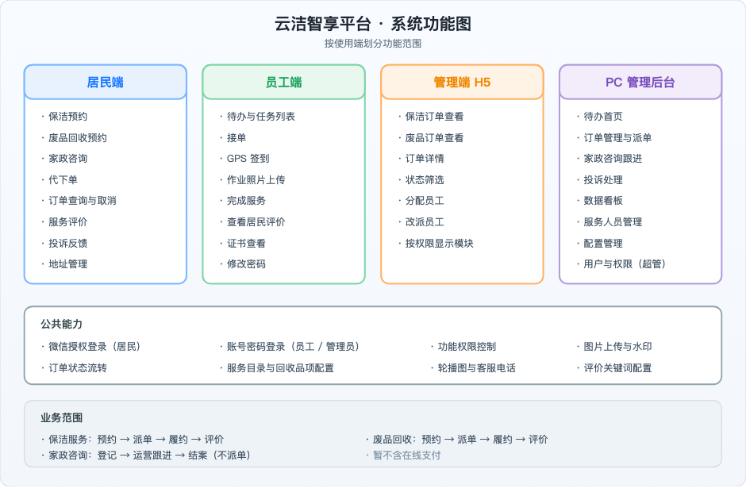
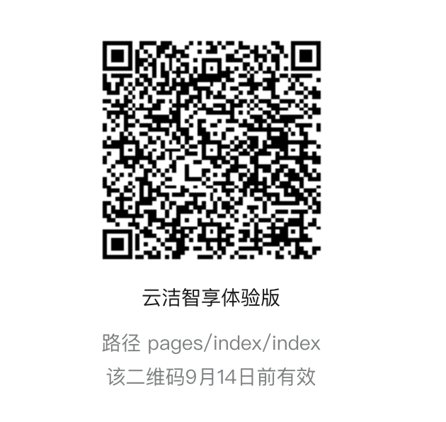
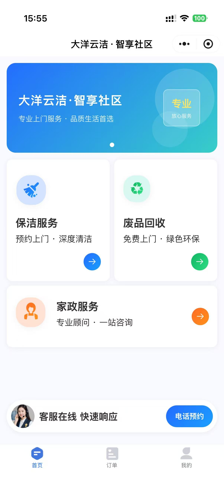
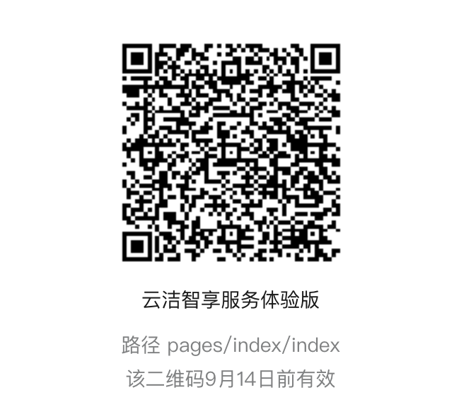
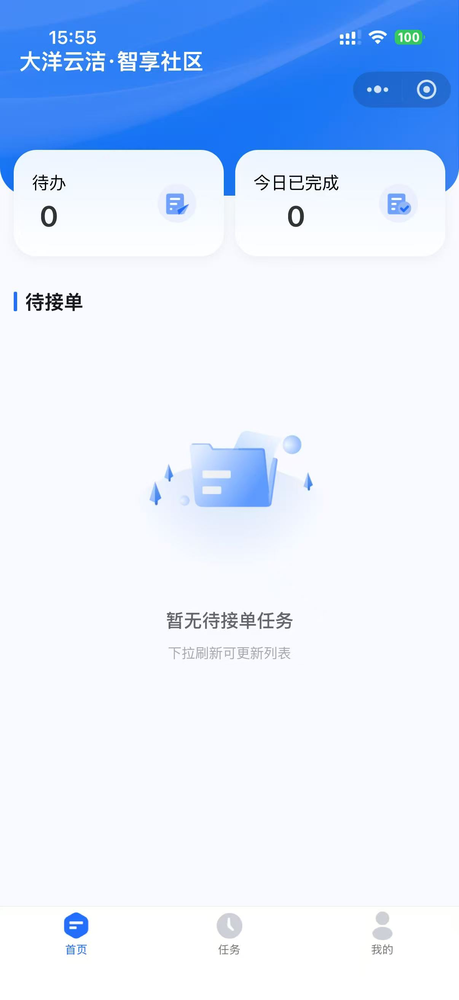
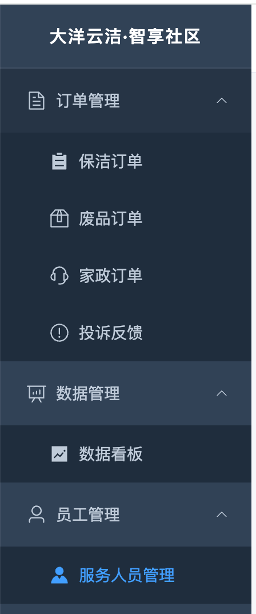
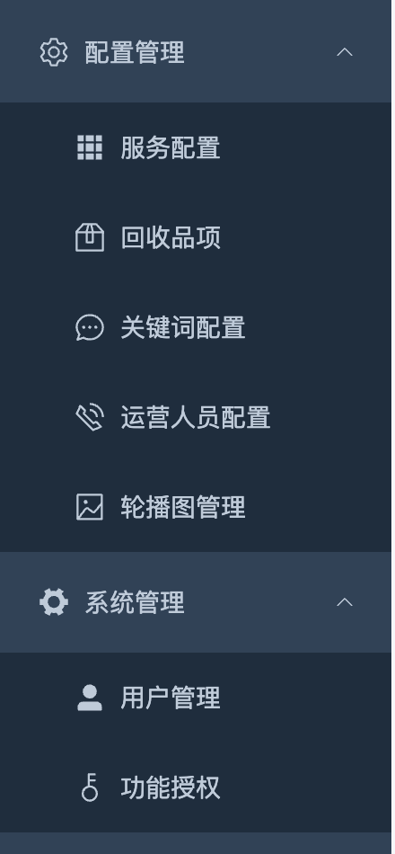

# 云洁智享平台功能文档

产品、运营、测试和新同事查功能用。  
更新：2026-09-07

---

## 1. 平台概览

大洋云洁做社区保洁、废品回收、家政咨询。居民小程序下单，运营派单，员工上门，PC 后台管配置和数据。

目前没有在线支付，下单履约不涉及收款。

| 端 | 名称 | 形态 | 谁用 | 干什么 |
|---|---|---|---|---|
| 居民端 | 云洁智享 | 微信小程序 | 居民 | 下单、查单、评价、投诉 |
| 员工端 | 云洁智享服务 | 微信小程序 | 保洁/回收员 | 接单、签到、拍照、完工 |
| 管理端 H5 | — | 微信里打开的网页 | 运营 | 手机上看单、分配/改派 |
| PC 后台 | — | 浏览器 | 运营/管理员 | 全功能：订单、员工、配置、看板 |

### 系统功能图

<div class="doc-screenshot doc-screenshot--diagram">



</div>

---

## 2. 账号

| 角色 | 怎么登 | 测试账号 |
|---|---|---|
| 居民 | 微信授权，首次自动注册 | 须同意隐私协议；建议下单前补手机号 |
| 员工 | 手机号 + 密码 | `15610203040` / `123456` |
| 管理员 | 邮箱 + 密码（PC 与 H5 共用） | `admin@dayunyunjie.com` / `admin123` |

---

## 3. 三类业务

| 类型 | 要点 | 怎么走 |
|---|---|---|
| 保洁 | 类型、时长 1～8h、预约时间、地址 | 派单 → 接单 → 签到 → 拍照 → 完工 → 评价 |
| 废品回收 | 品项、预估重量、地址、电梯/楼层 | 同上 |
| 家政咨询 | 类型、需求、联系方式 | 不派单，运营后台跟进到结案 |

三类都支持代下单，要填被服务人信息，订单会标「代下单」。

地址可存多条、设默认；评价完工后 7 天内有效；投诉在已接单后可提；轮播图和客服电话在 PC 后台配。

---

## 4. 规则（容易踩坑的几条）

1. 居民只能取消「待派单」的保洁/废品单。
2. 评价窗口 7 天，过了入口关。
3. 投诉要订单至少到「已接单」。
4. 废品完工由员工端点「完成服务」。
5. 家政标「已完成」前，须先有一条跟进记录。
6. 离职员工登不了员工端，也不会出现在派单列表。

---

## 5. 订单状态

**保洁 / 废品**

| 状态 | 说明 | 谁操作 |
|---|---|---|
| 待派单 | 居民已下单 | 管理端分配 |
| 已派单 | 已指定员工 | 员工接单 |
| 已接单 | 员工确认 | 员工开始服务 |
| 服务中 | 已 GPS 签到 | 传照片、完工 |
| 待评价 | 服务完成 | 居民评价 |
| 已评价 | 已评 | — |
| 已取消 | 已取消 | 居民（仅待派单）或管理端 |

```
居民下单 → 待派单 → 分配 → 已派单 → 接单 → 已接单 → 签到 → 服务中 → 完成 → 待评价 → 评价 → 已评价
```

家政：待跟进 → 跟进中 → 已完成。  
投诉：待处理 → 跟进中 → 已完成。

---

## 6. 居民端（云洁智享）

### 入口

<div class="doc-screenshot doc-screenshot--entry">



</div>

体验版二维码，正式对外文档建议换正式版；当前码标注 **9 月 14 日前** 有效。

### 首页

<div class="doc-screenshot doc-screenshot--home">



</div>

底部三个 Tab：**首页**（轮播 + 服务入口 + 客服）｜**订单**（三类列表，可按状态筛）｜**我的**（地址、投诉、客服、协议）。

**预约**

- 保洁：选类型时长 → 选日期时段（可代下单）→ 选地址提交  
- 废品：选品项重量 → 选日期时段 → 选地址，填电梯/楼层  
- 家政：选类型 → 填需求和联系方式（不要地址，不走派单）

订单详情看单号、状态、时间、地址、服务人员、进度。待派单可取消；完工 7 天内可评；已接单后可投诉。  
登录走微信授权，首次须同意隐私协议；未登录进不了受保护页。

---

## 7. 员工端（云洁智享服务）

### 入口

<div class="doc-screenshot doc-screenshot--entry">



</div>

体验版二维码，正式对外文档建议换正式版；当前码标注 **9 月 14 日前** 有效。

### 首页

<div class="doc-screenshot doc-screenshot--worker-home">



</div>

底部 Tab：**首页**（待办 + 待接单）｜**任务**（保洁/废品 Tab，可筛状态）｜**我的**（证书、改密码、退出）。

**按状态能做什么**

| 状态 | 操作 |
|---|---|
| 已派单 | 接单 |
| 已接单 | 开始服务（GPS 签到，超 200m 会标记） |
| 服务中 | 传前后照片（带水印）→ 完成服务 |
| 待评价 / 已评价 | 只看；已评价可看居民评语 |

离职不能登；派单按技能类型匹配；废品完工在员工端点。登录：手机号 + 密码。

---

## 8. 管理端 H5

**地址**：http://118.195.149.50/admin  

外出时用手机派单。Admin 邮箱密码登录。

能看保洁/废品列表和详情，按权限出 Tab，可筛状态；待派单可分配，已派单可改派（只能选在职且技能对的员工）。

没有家政、投诉、员工管理、配置、看板、用户管理——这些在 PC。

---

## 9. PC 管理后台

**地址**：http://118.195.149.50/dashboard

### 菜单

<div class="doc-screenshot doc-screenshot--sidebar">




</div>

| 模块 | 内容 |
|---|---|
| 首页 | 待办卡片（保洁/废品待派单、家政待跟进、投诉待处理），按权限显示 |
| 保洁/废品订单 | 列表、详情、分配/改派、代下单 |
| 家政咨询 | 列表、跟进、新建/跟进/完成（完成前要有跟进记录） |
| 投诉反馈 | 列表、详情、跟进、结束 |
| 数据看板 | 日/周/月统计、趋势、员工排名 |
| 服务人员 | 增删改、证书、在职/离职、重置密码 |
| 配置管理 | 服务目录、回收品项、评价词、运营人员、轮播图 |
| 系统管理（超管） | 用户管理、功能授权 |

---

## 附：四端能做什么

| 能力 | 居民端 | 员工端 | 管理 H5 | PC |
|---|---|---|---|---|
| 预约/代下单 | ✓ | — | — | 代下单 |
| 查看订单 | ✓ | — | — | ✓ |
| 查看/处理任务 | — | ✓ | — | — |
| 分配/改派 | — | — | ✓ | ✓ |
| 接单/签到/完工 | — | ✓ | — | — |
| 评价 | 提交 | 查看 | — | 查看 |
| 投诉 | 提交 | — | — | 处理 |
| 家政跟进 | — | — | — | ✓ |
| 员工/配置/看板 | — | — | — | ✓ |
| 用户/权限 | — | — | — | 超管 |

---

## 附图清单

| 文件 | 章节 | 说明 |
|---|---|---|
| `system-overview.png` | §1 平台概览 | 系统功能图（四端 + 后端 + 数据） |
| `customer-entry.png` | §6 居民端 · 入口 | 体验版小程序码 |
| `customer-home.jpg` | §6 居民端 · 首页 | 首页截图 |
| `worker-entry.png` | §7 员工端 · 入口 | 体验版小程序码 |
| `worker-home.jpg` | §7 员工端 · 首页 | 首页截图 |
| `1.png` / `2.png` | §9 PC 后台 · 菜单 | 左侧菜单截图（并排显示） |

目录：`docs/assets/apps-feature-guide/`
