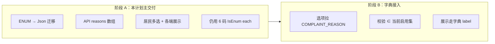

# 投诉原因多选（字典兼容）

> 存放位置：仓库根目录 [`plan/`](./)  
> 日期：2026-08-14（修订：2026-08-20，补充升级 SQL 落盘约定）  
> 性质：功能改造计划（投诉原因由单选改为多选；存储对齐业务字典快照约定）  
> 关联：[`biz-dict.md`](./biz-dict.md)（字典能力与 `COMPLAINT_REASON` 接入约定）  
> 手工升级 SQL：[`plan/sql/complaint-reasons-enum-to-json.sql`](./sql/complaint-reasons-enum-to-json.sql)

---

## 给执行本文件的 AI（硬规则）

1. **存储形态**：`complaints` 落库为 **value 的 JSON 字符串数组**（字段名 `reasons`），对齐 `reviews.tags`，**禁止**逗号拼接 VARCHAR、禁止存字典 `id`。  
2. **分两阶段执行**：先完成「多选 + Json 数组 + 枚举校验」；字典公开接口就绪后再接「拉选项 + 按启用集校验」。不要和「建字典表」捆成同一次超大 PR（见 [`biz-dict.md`](./biz-dict.md) §7.3）。  
3. **历史数据**：迁移时把原单值包成单元素数组；**不回写**、不级联改历史文案。  
4. **展示**：用 value 换 label；字典/映射查不到则**原样显示 value**。  
5. **禁止**：为多选新建投诉原因关联表；把 `ComplaintStatus` 做成可多选或字典。  
6. **升级 SQL**：迁移 SQL 必须另存一份到 [`plan/sql/`](./sql/)，供生产/后续手工升级使用；**不要只依赖** Prisma 生成的 `migrations/`。文件名：`complaint-reasons-enum-to-json.sql`。Prisma migrate 仍按项目惯例执行，两边 SQL 语义必须一致。

---

## 1. 问题基线

| 环节 | 现状 |
|------|------|
| 库表 | MySQL `complaints.reason` 为 `ENUM('POOR_ATTITUDE', …, 'OTHER')`，只能存**一个**码 |
| Prisma | [`Complaint.reason`](../apps/server/prisma/schema.prisma) → `ComplaintReason` |
| 创建 DTO | [`CreateComplaintDto.reason`](../apps/server/src/modules/complaint/dto/create-complaint.dto.ts) `@IsEnum` 单值 |
| Shared | [`CreateComplaintDto`](../packages/shared/src/dto/complaint.dto.ts) / [`ComplaintDto`](../packages/shared/src/entities/complaint.ts) 均为单个 `ComplaintReason` |
| 居民提交页 | [`complaint/index.vue`](../apps/miniapp-customer/src/pages/complaint/index.vue) `selectedReason` 单选覆盖 |
| 居民展示 | 列表 / 详情 / 订单详情按单个 `reason` 取 `COMPLAINT_REASON_LABELS` |
| 管理端 | [`orders/complaint/index.vue`](../apps/admin/src/views/orders/complaint/index.vue) 单个 tag；[`workers/index.vue`](../apps/admin/src/views/workers/index.vue) 可能展示单值 `reason` |

产品需求：投诉原因改为**多选**。后续运营通过业务字典增删原因时，**不应再改 `complaints` 表结构**。

[`biz-dict.md`](./biz-dict.md) §2.3 原约定为单值 `complaints.reason`；本计划将其**修订为数组快照**（见 §2.3）。

---

## 2. 设计结论

### 2.1 对标评价标签，不是逗号串

与 [`reviews.tags`](../apps/server/prisma/schema.prisma) 相同：

- API 收发：`reasons: string[]`（至少 1 项）
- 落库：Prisma `Json`，内容为 JSON 数组，例如 `["NOT_CLEAN","POOR_ATTITUDE"]`
- 只存字典/枚举的 **value**，不存 `biz_dict_items.id`

### 2.2 字段命名

| 旧 | 新 |
|----|----|
| `reason`（单值） | `reasons`（数组） |

API、Prisma、shared、三端类型一并改名，避免同一字段名有时是 string、有时是 array。

### 2.3 修订 biz-dict 快照约定（执行本计划时同步改 [`biz-dict.md`](./biz-dict.md) §2.3 / §7.2）

| 业务字段 | 存什么 |
|----------|--------|
| `appointTimeSlot` | 字典 `value`（单字符串） |
| `reviews.tags` | value / 中文标签 **数组**快照 |
| **`complaints.reasons`** | 字典 `value` **数组**快照（现为枚举码，如 `POOR_ATTITUDE`） |

原「`complaints.reason` 单 value」条目删除或改为指向本节。

§7.2 投诉原因成本说明改为：须把 Prisma `ComplaintReason` 列改为 `Json`（本计划完成）；接字典时 DTO 去掉死枚举、改为按启用集校验。运营新增原因只需插 `biz_dict_items`，**不必再 ALTER `complaints`**。

### 2.4 两阶段



- **阶段 A**：多选可用；选项与校验仍绑现有 6 码（shared / 前端常量兜底）。  
- **阶段 B**：依赖字典能力与公开 `GET .../enabled?type=COMPLAINT_REASON` 已落地；页面拉字典；后端按启用集校验；前端失败时用种子列表兜底。

阶段 B 可与「评价标签接入字典」同批或紧随其后，但**不要**阻塞阶段 A 的多选上线。

### 2.5 校验与停用语义（两阶段通用）

| 规则 | 说明 |
|------|------|
| 最少 1 个 | `@ArrayMinSize(1)` |
| 去重 | 提交前服务端可 `Set` 去重，避免重复码 |
| 阶段 A | 每个元素 ∈ 固定 `ComplaintReason` 集合 |
| 阶段 B | 每个元素 ∈ **当前启用**的 `COMPLAINT_REASON` value；停用项不可新选 |
| 历史 | 已存数组不回写；停用/改 label 不影响旧投诉；展示查不到 label 则显示原 value |
| `OTHER` | 可与其它原因同时选（产品若要求互斥再改；默认不互斥） |

### 2.6 明确不做

- 逗号分隔存库  
- 投诉原因多对多中间表  
- 本计划内实现完整字典 CRUD（那是 [`biz-dict.md`](./biz-dict.md)）  
- 改投诉处理状态机 / `ComplaintStatus`

---

## 3. 数据迁移

### 3.1 Prisma

```prisma
model Complaint {
  // ...
  reasons  Json   @map("reasons")   // string[]，至少迁移后保证非空数组
  // 删除 reason ComplaintReason
}
```

`ComplaintReason` enum：若全库无其它字段引用，迁移后可从 schema **删除**；阶段 A 的 TypeScript 联合类型可保留在 `packages/shared` 供校验与兜底列表使用。

### 3.2 SQL 要点（MySQL）

**手工升级副本（必交）：** [`plan/sql/complaint-reasons-enum-to-json.sql`](./sql/complaint-reasons-enum-to-json.sql)  
**Prisma migrate：** `apps/server/prisma/migrations/<timestamp>_complaint_reasons_json/migration.sql`  
两边语义必须一致。生产/后续升级时执行 `plan/sql/` 下脚本即可，不必只靠 Prisma。

步骤：

1. 新增可空 `reasons` JSON 列（或先 VARCHAR 中转，不推荐）  
2. `UPDATE complaints SET reasons = JSON_ARRAY(reason)`（把 ENUM 单值写入 JSON 数组）  
3. 将 `reasons` 设为 `NOT NULL`  
4. `DROP` 旧列 `reason`  
5. 若无其它依赖，清理 MySQL 上的 `ComplaintReason` 枚举类型（Prisma 通常随列删除处理）

回滚：需从 `reasons[0]` 写回 ENUM（仅当数组长度为 1 且码合法时安全）；多选上线后回滚成本高，迁移前确认备份。回滚参考 [`plan/sql/complaint-reasons-enum-to-json.rollback.sql`](./sql/complaint-reasons-enum-to-json.rollback.sql)。

### 3.3 兼容读（可选、短期）

若需灰度：Service `toDto` 可读 `reasons`，若旧行仍短暂存在 `reason` 则包成数组。推荐 **一次 migrate 做完**，不做长期双读。

---

## 4. 后端改动清单（阶段 A）

| 文件 | 改动 |
|------|------|
| [`schema.prisma`](../apps/server/prisma/schema.prisma) | `reason` → `reasons Json`；视情况删除 `enum ComplaintReason` |
| 新 migration | 见 §3 |
| [`create-complaint.dto.ts`](../apps/server/src/modules/complaint/dto/create-complaint.dto.ts) | `reasons: string[]`；`@IsArray()` `@ArrayMinSize(1)` `@IsEnum(..., { each: true })` |
| [`complaint.service.ts`](../apps/server/src/modules/complaint/complaint.service.ts) | create / `toDto` 读写数组；日志打印 `reasons` |
| [`complaint.spec.ts`](../apps/server/src/modules/complaint/complaint.spec.ts) | 单测改为数组；可补「多原因」「空数组拒绝」 |
| Swagger / 控制器 | 随 DTO 更新，无额外业务逻辑 |

出参 `ComplaintDto.reasons: string[]`（或 shared 的 `ComplaintReason[]`）。

---

## 5. Shared 改动清单（阶段 A）

| 文件 | 改动 |
|------|------|
| [`packages/shared/src/dto/complaint.dto.ts`](../packages/shared/src/dto/complaint.dto.ts) | `reasons: ComplaintReason[]` |
| [`packages/shared/src/entities/complaint.ts`](../packages/shared/src/entities/complaint.ts) | 同上 |
| [`packages/shared/src/enums`](../packages/shared/src/enums/index.ts) | 阶段 A **保留** `ComplaintReason` 常量与类型（校验 + 兜底） |
| [`packages/shared/src/labels`](../packages/shared/src/labels/index.ts) | `COMPLAINT_REASON_LABELS` 保留；可增工具函数 `formatComplaintReasons(values: string[]): string`（map + join「、」），供多端复用（可选） |

阶段 B 接字典后：枚举可降级为「仅兜底种子」，或逐步以字典为准，不必强删。

---

## 6. 居民端改动清单（阶段 A）

| 文件 | 改动 |
|------|------|
| [`api/complaint.ts`](../apps/miniapp-customer/src/api/complaint.ts) | `SubmitComplaintParams.reasons`；`ComplaintDto.reasons` |
| [`pages/complaint/index.vue`](../apps/miniapp-customer/src/pages/complaint/index.vue) | `selectedReasons: ComplaintReason[]`；点击 toggle；高亮 `includes`；校验 length≥1；提交传数组 |
| [`pages/complaint-list/index.vue`](../apps/miniapp-customer/src/pages/complaint-list/index.vue) | 多 value → 文案 join 或换行 |
| [`pages/complaint-detail/index.vue`](../apps/miniapp-customer/src/pages/complaint-detail/index.vue) | 同上 |
| [`pages/order-detail/index.vue`](../apps/miniapp-customer/src/pages/order-detail/index.vue) | 投诉卡片原因展示同上 |

交互细节：

- Chip 多选，样式可沿用现有 `reason-chip` / `reason-chip-active`  
- 提交按钮 disabled：`selectedReasons.length === 0` 或描述为空或上传中  
- 文案：「请选择投诉原因」（可改为「请至少选择一项」）

---

## 7. 管理端改动清单（阶段 A）

| 文件 | 改动 |
|------|------|
| [`apps/admin/src/api/complaint.ts`](../apps/admin/src/api/complaint.ts) | DTO `reasons: string[]` |
| [`views/orders/complaint/index.vue`](../apps/admin/src/views/orders/complaint/index.vue) | 详情多个 `el-tag`；列表若展示原因则 join 或多 tag |
| [`views/workers/index.vue`](../apps/admin/src/views/workers/index.vue) | 投诉原因展示改为数组 map |

阶段 A 仍用本地 `REASON_LABEL_MAP` / shared labels；阶段 B 改为字典 label，查不到显示原码。

---

## 8. 阶段 B：接入业务字典（依赖 [`biz-dict.md`](./biz-dict.md)）

前置：`biz_dict_items`、种子 `COMPLAINT_REASON`、`GET` 启用项接口可用。

| 项 | 做法 |
|----|------|
| 居民投诉页选项 | `GET /biz-dict-items/enabled?type=COMPLAINT_REASON`；失败用种子 6 项兜底 |
| 创建校验 | 去掉死 `IsEnum`；查启用 value 集合；非法码 400 |
| 管理端展示 | value → 当前字典 label |
| 运营新增原因 | 只加字典项；**不改 `complaints.reasons` 列**；小程序拉启用列表即可（居民端若未发版，仍只见旧兜底——阶段 B 建议连同小程序发版或接受兜底滞后） |
| 系统项 | 种子 6 码 `isSystem=true`；`OTHER` 不可停用（与 biz-dict 一致） |
| 改 value | 系统项禁止改 value；未迁完前勿让运营改历史码（阶段 A 完成后列已是 Json，改 value 主要影响「新提交校验与展示映射」，旧快照仍显示旧码） |

阶段 B **不再**需要 `ALTER TABLE complaints`。

---

## 9. 测试要点

**阶段 A**

- [ ] 迁移后旧投诉 `reasons` 为单元素数组，列表/详情展示正确  
- [ ] 提交 1 个原因成功  
- [ ] 提交多个原因成功，库中为 JSON 数组  
- [ ] 提交 `reasons: []` 或缺省 → 400  
- [ ] 非法码 → 400  
- [ ] 居民多选 toggle / 提交 / 详情展示  
- [ ] 管理端投诉详情多 tag  
- [ ] 单测 `complaint.spec.ts` 全绿  

**阶段 B**

- [ ] 字典新增启用项后，不改表结构即可提交该 value  
- [ ] 停用项不可新选，历史含该 value 仍可展示  
- [ ] 公开接口失败时前端兜底列表非空  

---

## 10. 建议执行顺序

1. Prisma schema + migration + 数据回填，**同时**把等价 SQL 保存到 [`plan/sql/complaint-reasons-enum-to-json.sql`](./sql/complaint-reasons-enum-to-json.sql)  
2. Shared DTO/Entity + 后端 DTO/Service/单测  
3. 居民 API + 提交页多选 + 三处展示  
4. 管理端 API + 投诉页 / 员工页展示  
5. （文档）更新 [`biz-dict.md`](./biz-dict.md) §2.3 / §7.2 快照与成本说明  
6. （后续独立 PR）阶段 B 接字典  

---

## 11. 验收标准

- 居民可多选投诉原因并成功提交；库内为 JSON 字符串数组。  
- 历史单值投诉迁移后展示不丢。  
- 各端展示支持多个原因。  
- 存储形态与评价标签一致，为后续 `COMPLAINT_REASON` 字典接入铺路；接入后运营加原因**无需再改投诉表结构**。  

---

## 12. 非目标

- 本计划不实现业务字典表与管理端配置页（见 [`biz-dict.md`](./biz-dict.md)）。  
- 不改投诉状态流转、跟进记录、凭证上传逻辑。  
- 不做按原因的复杂统计报表（若以后要按 reason 筛，再考虑生成列或 JSON 查询，不在本次范围）。
