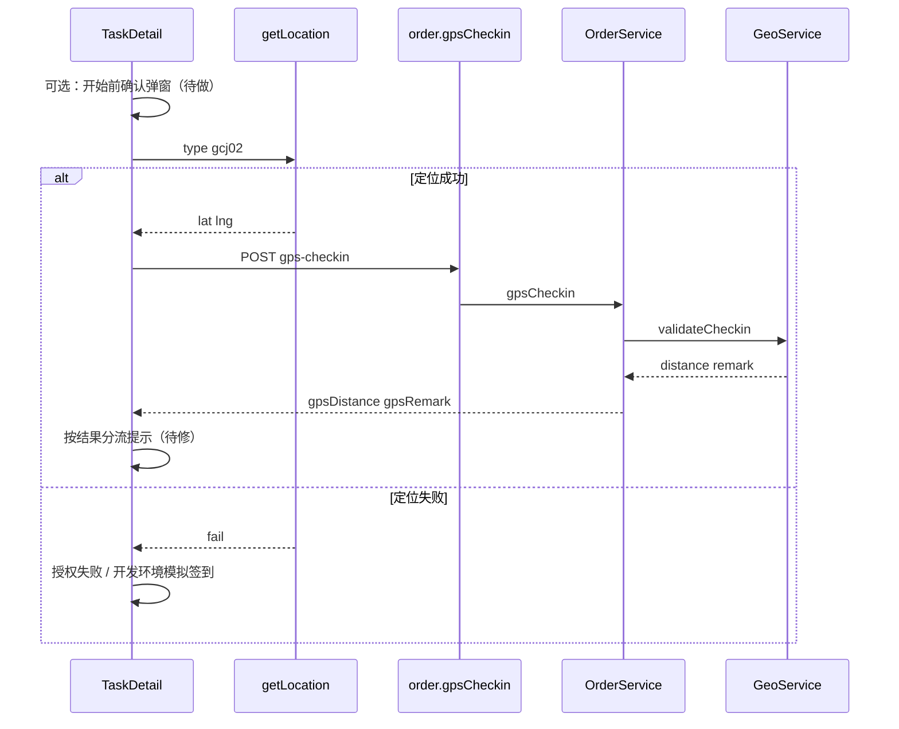

# GPS 签到、地址坐标与距离校验方案

> 状态：文档已定稿，**代码后续再改**  
> 范围：居民端地址维护、员工端开始服务签到、后端 Haversine 200m 校验、成功/失败/跳过提示  
> 相关代码：
> - 员工端 [`apps/miniapp-worker/src/pages/task-detail/index.vue`](../apps/miniapp-worker/src/pages/task-detail/index.vue)
> - 员工 API [`apps/miniapp-worker/src/api/order.ts`](../apps/miniapp-worker/src/api/order.ts)
> - 居民地址编辑 [`apps/miniapp-customer/src/pages/address-edit/index.vue`](../apps/miniapp-customer/src/pages/address-edit/index.vue)
> - 后端 Geo [`apps/server/src/common/geo/geo.service.ts`](../apps/server/src/common/geo/geo.service.ts)
> - 保洁/废品 `gpsCheckin` Service / Controller

---

## 1. 背景与目标

员工「开始服务」会 GPS 签到，后端用订单服务地址坐标与员工当前位置做 **200m** 距离校验（Haversine）。  
当前居民端新增地址**不采集经纬度**，导致绝大多数订单走「跳过距离校验」，200m 规则形同虚设；员工端又把所有 `gpsRemark` 当成「超距」提示，文案易误导、易产生纠纷。

本方案目标：

1. **地址维护**：明确 lat/lng 如何采集、落库、进入订单快照  
2. **距离校验**：固化对比点、阈值、坐标系、跳过条件  
3. **结果分流**：校验成功 / 超距 / 无坐标跳过 / 定位失败，各自提示与是否阻断  
4. **分阶段落地**：短期先修员工提示；中期补地址选点；长期可选结构化 checkinStatus

---

## 2. 现状摘要

| 环节 | 现状 |
|------|------|
| 居民新增/编辑地址 | 仅姓名、手机、省市区、详细地址；**不传 lat/lng** |
| 后端 Address | 表字段 `lat`/`lng` 可选；DTO 可选；有则下单写入 `addressSnapshot` |
| 员工开始服务 | `uni.getLocation(gcj02)` → `POST .../gps-checkin` |
| 后端校验 | `GeoService.validateCheckin`，默认 200m；超距/无坐标**不阻断**，只写 `gpsRemark` |
| 员工端提示 | 任意 `gpsRemark` 都弹「距服务地址较远（Xm）」——无坐标时文案错误 |

状态机前置：须先 `ACCEPTED`；`ASSIGNED` 需先「立即接单」，不可直接签到。

---

## 3. 地址维护（服务地址点 A）

### 3.1 数据流

```
居民 Address.lat/lng
  → 下单 toAddressSnapshot（有数字才写入）
  → order.addressSnapshot.lat/lng
  → gpsCheckin 时作为点 A
```

无 lat/lng 时：快照无坐标 → 校验跳过。

### 3.2 当前缺口

- 居民端 [`address-edit`](../apps/miniapp-customer/src/pages/address-edit/index.vue) / [`api/address.ts`](../apps/miniapp-customer/src/api/address.ts) 未暴露、未提交坐标  
- 管理后台文本代下单通常只有文字 `detail`，也无坐标  
- 单测中的天安门坐标为手工假数据，不代表线上采集

### 3.3 拟定改造（中期）

在新增/编辑地址时用 **`uni.chooseLocation`** 选点（与员工 `getLocation` 同属微信 GCJ-02，坐标系一致）：

1. UI 增加「选择位置」入口  
2. 成功后写入 `latitude` / `longitude`，并可回填/校正详细地址文案  
3. `createAddress` / `updateAddress` 携带 `lat`、`lng`  
4. 居民端 `AddressDto` 类型补齐 lat/lng（列表展示不必强显）  
5. 保存时建议：**必须选点才可保存**（或至少强提示）；否则后续订单仍无法自动校验  

可选备选：对文字地址做腾讯/高德地理编码（需 Key、配额与坐标系对齐），不如 `chooseLocation` 直接。

### 3.4 历史数据

已存在无坐标的 Address / 订单快照：

- 不强制回填；签到继续走「跳过」分支 + 员工提示  
- 若后续要批量补坐标，另开地理编码任务（本方案不展开）

---

## 4. 距离校验逻辑

### 4.1 两个对比点

| 点 | 含义 | 来源 |
|----|------|------|
| A | 服务地址 | `addressSnapshot.lat/lng` |
| B | 员工签到位置 | `uni.getLocation({ type: 'gcj02' })` → 请求体 `lat/lng` |

阈值：默认 **200 米**（`validateCheckin(..., thresholdM = 200)`）。  
判定：`distanceM > 200` 为超距；`<= 200` 为在范围内。

### 4.2 Haversine（后端已实现）

文件：[`apps/server/src/common/geo/geo.service.ts`](../apps/server/src/common/geo/geo.service.ts)

- 地球半径 `R = 6371000` m  
- 用两点经纬度算球面大圆距离（米）  
- 结果保留 1 位小数写入 `gpsDistance`  
- **不做**坐标系转换；假定 A、B 同为 GCJ-02  
- **不是**路径距离 / 楼层 / 微信围栏 API，仅为两点直线球面距离

### 4.3 后端分支（`validateCheckin`）

```
若 A.lat 或 A.lng 不是 number
  → distance=null, remark="地址无坐标，跳过距离校验", outOfRange=false

否则 distanceM = haversineMeters(A, B)
  若 distanceM > 200
    → remark=`超距签到，距离Xm`, outOfRange=true
  否则
    → remark=null, outOfRange=false
```

`gpsCheckin` Service（保洁/废品对称）：

1. 读订单快照坐标  
2. 调用 `validateCheckin`  
3. 事务内写入 `gpsLat/gpsLng/gpsCheckinAt/gpsDistance/gpsRemark`  
4. 状态机：`ACCEPTED → IN_SERVICE`（remark 可带超距/跳过说明）  
5. 返回最新订单（含 gps* 字段）

接口：

```
POST /cleaning-orders/:id/gps-checkin
POST /recycling-orders/:id/gps-checkin
body: { lat, lng, operatorId }
```

### 4.4 员工端调用链（现状）



---

## 5. 校验成功与失败（含跳过）的产品逻辑

原则：**距离相关一律软处理**——不因超距/无坐标阻断进入 `IN_SERVICE`；用提示把责任边界说清，降低纠纷。  
真正失败仅限：未登录、状态非法、定位失败用户取消、接口业务错误等。

### 5.1 结果矩阵

| 场景 | 后端 | 状态是否推进 | 员工端提示（拟定） |
|------|------|--------------|-------------------|
| 校验成功（≤200m） | `gpsRemark=null`，有 `gpsDistance` | 是 → IN_SERVICE | Toast：已开始服务 |
| 超距（>200m） | `gpsRemark` 含「超距签到」，`gpsDistance` 有值 | 是 | Modal：GPS 距离提醒，展示具体米数，确认后继续 |
| 无坐标跳过 | `gpsRemark` 含「无坐标/跳过」，`gpsDistance=null` | 是 | Modal：未能校验距离；请确认已在订单服务地址 **200 米内**签到，以免纠纷 |
| 定位失败（用户取消/无权限） | 未调签到接口 | 否 | Modal：请授权位置；开发工具可「模拟签到」 |
| 接口/状态机失败 | 抛错 | 否 | Toast：错误信息 |
| 用户取消「开始前确认」 | 未定位 | 否 | 无额外提示，停留 ACCEPTED |

### 5.2 开始服务前确认（拟定，短期必做）

点「开始服务」后、调用 `getLocation` 前：

- 标题：确认开始服务  
- 内容：请确认您已到达服务地址附近（建议 200 米内）再签到。系统将记录签到位置；若订单地址缺少坐标，将无法自动校验距离。  
- 按钮：确认 / 取消  

有坐标后可将文案缩短为「请确认已在服务地址 200 米内」。

### 5.3 签到后分流（拟定，短期必做，修现有 bug）

禁止「凡有 `gpsRemark` 都当超距」。按类型分流：

1. remark 含「跳过」或「无坐标」→ 「未能校验距离」文案  
2. remark 含「超距」→ 保留超距 + 米数  
3. remark 为空 → 成功 toast  

可选增强（中后期）：后端增加明确枚举，避免前端字符串判断：

```ts
checkinStatus: 'ok' | 'out_of_range' | 'skipped'
```

### 5.4 与「硬阻断」的边界（本阶段不做）

若未来产品要求「超距禁止开始服务」，需单独评审：状态机是否允许、误定位误伤、申诉流程等。本方案维持与现后端一致的**软校验**。

---

## 6. 分阶段落地（后续再改代码时按此执行）

### P0 — 员工端提示（不依赖地址选点）

- [ ] `handleStartService`：开始前确认弹窗  
- [ ] 签到成功后按 `gpsRemark` 分流（成功 / 超距 / 无坐标跳过）  
- [ ] 修复无坐标时「较远（m）」错误文案  
- [ ] 模拟签到路径复用同一套分流逻辑  

涉及：[`task-detail/index.vue`](../apps/miniapp-worker/src/pages/task-detail/index.vue)

### P1 — 居民端地址坐标采集

- [ ] `address-edit` 接入 `uni.chooseLocation`  
- [ ] `api/address.ts` 增加 lat/lng  
- [ ] 保存时写入后端（DTO 已支持）  
- [ ] 小程序隐私/权限：`chooseLocation` / 相关 `requiredPrivateInfos`  
- [ ] 下单快照自然带上坐标后，200m 校验开始生效  

涉及：居民端地址页 + manifest；后端一般不用改字段

### P2 — 体验与可观测性（可选）

- [ ] 员工端 `AddressSnapshot` 类型补 `lat?/lng?`，前确认文案可按有无坐标切换  
- [ ] 后端返回 `checkinStatus` 枚举  
- [ ] 管理端/日志对超距、跳过占比做统计  
- [ ] 历史无坐标地址补录策略（若需要）

---

## 7. 验收要点

1. **有坐标 + 近距离**：签到成功，toast「已开始服务」，`gpsRemark` 空，状态 IN_SERVICE  
2. **有坐标 + 超距**：签到成功，弹超距 Modal（有米数），状态仍 IN_SERVICE，库中有备注  
3. **无坐标**：签到成功，弹「未能校验距离」提示（不再显示假超距），状态 IN_SERVICE，`gpsRemark` 为跳过说明  
4. **开始前取消**：不定位、不调接口、状态仍 ACCEPTED  
5. **定位拒绝**：不进入 IN_SERVICE；开发环境模拟签到仍可用且走同一分流  
6. **P1 后**：新地址带 lat/lng，新订单快照可被 200m 校验  

---

## 8. 关键决策记录

| 决策 | 选择 |
|------|------|
| 超距是否阻断开始服务 | 否（软校验，只提示） |
| 无坐标是否阻断 | 否；必须明确提示员工自证在 200m 内 |
| 地址坐标采集方式 | 优先 `uni.chooseLocation`（GCJ-02） |
| 坐标系转换 | 不做；两端统一 GCJ-02 |
| 实现顺序 | 先 P0 员工提示，再 P1 地址选点 |

---

## 9. 参考：现有关键实现位置

- 员工开始服务 / 模拟签到：`task-detail/index.vue` → `handleStartService`  
- API：`gpsCheckin()` → `POST /{cleaning|recycling}-orders/:id/gps-checkin`  
- 距离：`GeoService.haversineMeters` / `validateCheckin`  
- 订单写库与状态：`CleaningOrderService.gpsCheckin` / `RecyclingOrderService.gpsCheckin`  
- 地址快照：`toAddressSnapshot`（仅当 address 已有 lat/lng）
