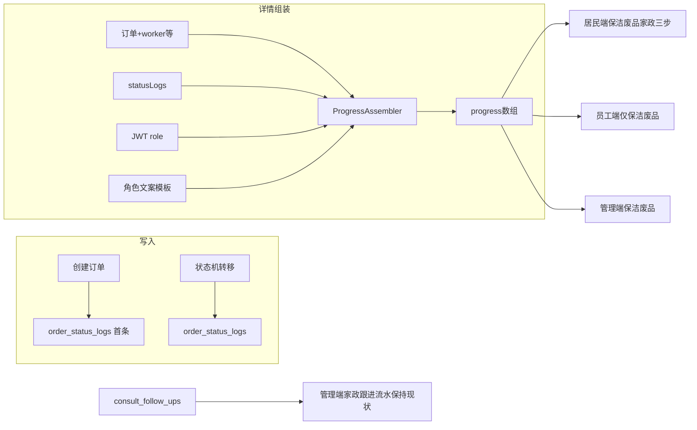

# 服务进度（Order Progress）实现计划

> 存放位置：仓库根目录 [`plan/`](./)（与 [`wechat-notify-auth-roadmap.md`](./wechat-notify-auth-roadmap.md) 同级）  
> 创建背景：订单详情「服务进度」讨论结论汇总；后续再实现  
> 日期：2026-08-13  
> 修订：同日补充身份区分、列表不返回 progress、创建首条 log 规则、家政两端展示差异  
> 范围：仅「订单详情服务进度」；三端列表角标、Tab 筛选等写死状态文案见 [`order-status-labels-consolidate.md`](./order-status-labels-consolidate.md)。

---

## 问题基线

- 居民端 [`OrderStatusTimeline.vue`](../apps/miniapp-customer/src/components/OrderStatusTimeline.vue) 只按当前 `status` 高亮，无操作信息、无真实时间。
- 员工端 [`task-detail/index.vue`](../apps/miniapp-worker/src/pages/task-detail/index.vue) 进度节点与 `desc` 写死；时间依赖不存在的 `assignedAt` / `completedAt` / `reviewedAt`。
- 管理端保洁/废品详情亦为本地节点 + 当前状态算高亮（[`cleaning/index.vue`](../apps/admin/src/views/orders/cleaning/index.vue)、[`recycling/index.vue`](../apps/admin/src/views/orders/recycling/index.vue)）。
- 管理端家政详情「服务进度」实际是跟进流水（已预约 + 每条 `consult_follow_ups` + 已完成），不是三步状态轴。
- 后端已有 [`order_status_logs`](../apps/server/prisma/schema.prisma) 与状态机写入（[`order-state-machine.service.ts`](../apps/server/src/common/order-state-machine/order-state-machine.service.ts)），详情 DTO **未返回**；创建订单 **不写** 首条 log。
- 三端详情打同一套 URL（`GET /cleaning-orders/:id`、`GET /recycling-orders/:id`、`GET /consult-orders/:id`），**当前未挂 Guard**，服务端拿不到观看角色；请求里已带 `Authorization`，JWT payload 含 `role`。

---

## 设计结论（已拍板）

1. **节点 = 库状态全量（保洁/废品）**：`PENDING_ASSIGN → ASSIGNED → ACCEPTED → IN_SERVICE → PENDING_REVIEW → REVIEWED`（取消单独短轴）。员工端不再把已派单+已接单折成一步。
2. **时间/是否到达** 来自 `order_status_logs`（缺首条时用 `createdAt` 兜底，含历史单）。
3. **操作信息** 不入库；服务端按观看角色套模板（`RESIDENT` / `WORKER` / `ADMIN`）。管理员用第三人称/运营视角，不说「您」。
4. **仅详情 API 返回组装好的 `progress`**；列表接口不查、不返回。前端只渲染。
5. **创建订单时写入首条 log**（见下文操作人规则），与后续变更统一数据源。
6. **家政两端不同展示**（见「家政服务进度」专节）：居民三步 `progress`；管理端保持现有跟进流水（有几条跟进展示几条）；员工端不考虑家政。
7. **评价**：进度只出现「已评价」节点（标题 + 一句模板 + 时间）；星级/标签/图片仍读 `reviews`，不写进 progress。



---

## 1. 订单详情接口区别身份

三端继续共用现有详情 URL，**不拆成三套接口**。

| 接口 | 保洁 | 废品 | 家政 |
|---|---|---|---|
| 详情 | `GET /cleaning-orders/:id` | `GET /recycling-orders/:id` | `GET /consult-orders/:id` |

实现要点：

- 详情组装 `progress` 时读取 JWT `role`（居民 / 员工 / 管理员），套对应模板后写入 `progress[].label` 与 `progress[].message`。
- 现状：订单 Controller 未挂 Guard。实现时要能从已有 `Authorization` 解析身份；无 Token 时降级为中性或管理端文案，避免把现网详情打成 401（具体降级文案实现时定）。
- 员工端无家政任务：咨询单详情 **不必** 出员工模板。
- 同一订单、不同角色看到的节点/顺序/时间相同，**仅操作信息（及展示名）不同**。

---

## 2. 订单列表接口不放 progress

| 接口 | `progress` |
|---|---|
| `GET /cleaning-orders`、`GET /recycling-orders`、`GET /consult-orders`（列表） | **不查询、不返回** |
| 对应 `GET /:id` 详情 | 查询 `order_status_logs` 并返回 `progress` |

禁止把 `progress` 塞进现有共用的 `toDto()`（列表和详情都走它）。只在 `findOne`（以及状态变更后返回详情的路径）组装。

列表页继续只用 `status` 做角标/筛选（写死文案另议）。

---

## API 约定（详情）

```ts
progress: Array<{
  status: string;              // 库枚举
  label: string;               // 该角色展示名
  state: 'done' | 'current' | 'pending';
  message: string | null;      // 未到达可为 null
  operatedAt: string | null;   // ISO；未到达为 null
}>
```

- 取消单（仅保洁/废品）：短轴（已下单/待派单 done + 已取消 current），不展示后续履约节点。
- 老单无创建 log：首节点 `operatedAt = createdAt`。
- shared 增加 `ProgressNodeDto`，接到保洁/废品/家政**详情**类型；列表类型不加。

---

## 3. 创建写首条 log

与插订单同一事务；失败整单回滚。不改 Prisma 表结构。`from_status` 统一为 `NONE`。

| 谁下单 | `operatorType` | `operatorId` | `toStatus` |
|---|---|---|---|
| 居民端小程序 | `RESIDENT` | 该居民 `residentId` | 保洁/废品 `PENDING_ASSIGN`；家政 `FOLLOW_UP` |
| 管理端新增/代下单/电话单 | `ADMIN` | 当前登录管理员 id | 同上 |

约束：

- `operator_id` 非空：管理端创建必须带上当前 admin；电话单 `residentId` 可空，操作人仍用管理员，禁止写假 ID（如 0）。
- 历史已存在订单 **不补写** 首条 log；组装时用 `createdAt` 兜底。
- 后续派单/接单/开始/完成/评价/取消仍走现有状态机写 log（家政状态变更已写 `order_type=CONSULT`）。
- 作业照片、评价内容、家政跟进正文 **不** 写入 `order_status_logs`。

---

## 4. 家政服务进度（按端）

家政订单状态仍是 3 个：`FOLLOW_UP`（待跟进）→ `FOLLOWING`（跟进中）→ `COMPLETED`（已完成）。  
多次跟进只存在 `consult_follow_ups`，**不会**在 `order_status_logs` 里重复「跟进中」。

### 居民端

用详情 `progress` 固定 **3 步**。跟进中无论后台有几条跟进，只显示一句，**不展示跟进正文/处理人/次数**，也不拉 `GET /consult-orders/:id/follow-ups`。

| 节点 | 操作信息 |
|---|---|
| 待跟进 | 您已提交咨询，等待平台跟进 |
| 跟进中 | 运营人员正在跟进中 |
| 已完成 | 咨询已完成 |

### 管理端

**保持现状**：详情「服务进度」继续用跟进流水，**不换成**居民那套 3 步 `progress`。

- 已预约 / 待跟进（创建时间）
- **每一条** `consult_follow_ups`（有几条展示几条：处理人、内容、时间）
- 已完成（状态到 `COMPLETED` 时出现）

列表/状态标签仍用 `FOLLOW_UP / FOLLOWING / COMPLETED`。

### 员工端

家政不进员工端，**不做**家政进度。

---

## 文案模板（实现时落代码常量，可微调）

### 保洁 / 废品（三端详情 `progress`）

| status | 居民 | 员工 | 管理端 |
|---|---|---|---|
| PENDING_ASSIGN | 您已下单，等待平台派单 | 用户已下单，等待平台派单 | 居民已下单，待派单 |
| ASSIGNED | 系统派单给「{workerName}」 | 系统派单给了您 | 已派单给「{workerName}」 |
| ACCEPTED | {workerName}已接单 | 您已接单 | {workerName}已接单 |
| IN_SERVICE | {workerName}已上门，开始服务 | 您已上门，开始服务 | {workerName}已上门，服务进行中 |
| PENDING_REVIEW | 服务已完成，待您评价 | 您已完成服务，等待用户评价 | 服务已完成，待居民评价 |
| REVIEWED | 您已完成评价 | 用户已完成评价 | 居民已评价 |
| CANCELLED | 订单已取消 | 订单已取消 | 订单已取消 |

### 家政（仅居民端 `progress`；管理端不用此表）

见上一节居民端三步文案。无员工模板。

---

## 后端改动要点

- 创建：[`cleaning-order.service`](../apps/server/src/modules/cleaning-order/cleaning-order.service.ts) / recycling / consult 的 create 事务内按第 3 节写 `orderStatusLog.create`；管理端创建需能拿到当前 `adminId`。
- 新建共享组装器（如 `common/order-progress/`）：查 logs → 按类型选节点表 → 算 state → 按 JWT role 套模板。
- **仅** `findOne`（详情）附带 `progress`；列表 `findAll` / 共用 `toDto` 不加。
- 详情三个 Controller 解析身份后再组装（保洁、废品、家政同一组装器）。
- 家政管理端跟进接口维持现有 `GET/POST .../follow-ups`，本计划不改其语义。

---

## 前端改动要点

- 居民保洁/废品：详情把 `progress` 传给时间轴，渲染 label / message / time / done|current|pending。
- 居民家政：同一时间轴组件吃 3 步 `progress`；不展示多条跟进。
- 员工：删除本地 `timelineNodes` 硬编码，改用接口 `progress`（仅保洁/废品，6 步全量）。
- 管理保洁/废品：详情静态节点改为渲染 `progress`。
- 管理家政：**不改**现有跟进时间轴。

实现时同步修正依赖 `create` / `findOne` 的 Jest（非产品功能）。

---

## 明确不做（本计划）

- 列表/Tab/角标写死状态文案统一（见 [`order-status-labels-consolidate.md`](./order-status-labels-consolidate.md)）。
- 进度文案入库、新建 progress 表。
- 改状态机枚举；员工端继续折叠已派单+已接单。
- 预约时间字段改造（与进度无关）。
- 居民端家政跟进明细列表。
- 用 3 步 `progress` 替换管理端家政跟进流水。
- 进度节点内展示评价星级/标签/图片。

---

## 实现待办（后续执行）

1. 三类订单 create 按第 3 节写入首条 `order_status_logs`
2. 实现 ProgressAssembler；详情按 JWT role 返回 `progress`；列表不返回
3. shared 增加 `ProgressNodeDto` 并只接到详情类型
4. 居民端时间轴消费详情 `progress`（含家政三步）
5. 员工端详情去掉本地 `timelineNodes`，改用 `progress`
6. 管理端仅保洁/废品详情改用 `progress`；家政跟进轴保持现状
7. 更新受影响的后端单测

---

## 验收

- 新保洁/废品单：详情 progress 节点数与库状态一致；每步转移后对应节点出现时间；居民/员工/管理员操作信息不同。
- 列表接口响应无 `progress` 字段。
- 创建事务内必有首条 log；管理端代下单 `operatorType=ADMIN` 且 `operatorId` 为真实管理员。
- 评价后末节点为已评价（仅模板句 + 时间）；`reviews` 仍在详情评价区单独展示。
- 居民家政：始终 3 步；跟进中文案为「运营人员正在跟进中」，不出现多条跟进。
- 管理家政：跟进有几条展示几条；不改为三步轴。
- 取消单：短轴正确。
- 历史无首条 log 的订单：首节点时间仍有值（createdAt 兜底）。
- 员工端无家政进度入口。
