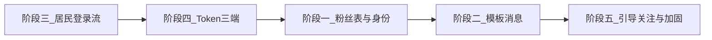

# 微信通知 / 登录鉴权 / Token 完善计划

> 存放位置：仓库根目录 [`plan/`](./)（勿放入 `~/.cursor/plans`，便于后续查找）  
> 创建背景：居民端登录弹窗、三端 Token、服务号粉丝与模板消息讨论结论汇总  
> 日期：2026-08-12

---

## 目标总览

1. **打基础**：记录服务号粉丝；完善居民端 / 员工端小程序登录身份（openid / unionid），为后续服务号模板消息做准备。  
2. **发消息**：实现订单状态变更时给关注服务号的居民 / 员工发送模板消息；列齐所需配置与字段。  
3. **居民端登录流**：启动即静默登录，有手机号不弹窗；修手输手机号等体验问题。  
4. **Token**：access 改为 8 小时，refresh 仍 7 天；refresh 过期清登录态；三端都真正调用刷新。  
5. **补齐讨论中尚未落地的缺口**（见文末清单）。

---

## 现状摘要（问题基线）

| 项 | 现状 |
|---|---|
| 居民身份 | `Resident.openid`（小程序）；`code2session` 的 **unionid 未落库** |
| 员工身份 | 手机号 + 密码；**无** wx.login / openid / unionid（表注释写明 v2.0 已删 openid） |
| 服务号 | **无** 回调、无粉丝表、无模板发送 |
| 居民登录流 | 逻辑在首页 `onShow`；本地无 phone 时易过早弹「一键授权」 |
| 手输手机号 | `ProfileCompleteModal` 有「输一位就切换已填 UI」bug；手输多半只写本地、不写库 |
| Token 默认 | access **2h**，refresh **7d**（`JWT_ACCESS_EXPIRES_IN` / `JWT_REFRESH_EXPIRES_IN`） |
| 刷新调用 | 后端有 `POST /auth/refresh`；**仅员工端** `ensureSession` 在用；居民端只存 refresh；Admin 只存 access，401 直接登出 |

居民 / 员工是 **两张表**：`residents`、`workers`。同一微信用户可能两边都有账号，服务号粉丝不宜只塞进其中一张。

---

## 阶段一：服务号粉丝 + 小程序身份完善（为模板消息做准备）

### 1.1 数据模型

**新增长期粉丝表**（推荐名：`wechat_oa_followers`），记录关注服务号的粉丝，而非用完即删的临时表：

| 字段 | 说明 |
|---|---|
| `id` | 主键 |
| `oaOpenid` | 服务号 openid（**发模板消息用**），唯一 |
| `unionid` | 开放平台 UnionID，可空但应尽量写入；建索引 |
| `subscribed` | 是否仍关注 |
| `subscribedAt` / `unsubscribedAt` | 关注 / 取关时间 |
| `residentId` | 可空，对上居民后回填 |
| `workerId` | 可空，对上员工后回填 |
| `createdAt` / `updatedAt` | 审计 |

**完善居民 / 员工表登录身份字段：**

| 表 | 新增 / 恢复 |
|---|---|
| `residents` | `unionid`（可空 + 索引）；保留现有小程序 `openid` |
| `workers` | `mpOpenid`（员工小程序 openid，可空 + 唯一）、`unionid`（可空 + 索引） |

说明：

- 发模板消息主路径：`resident/worker.unionid` → 查 `wechat_oa_followers`（`subscribed=true`）→ 取 `oaOpenid`。  
- 产品主路径建议：**先登录小程序，再引导关注服务号**；库表仍支持「先关注再登录」。  
- 可选增强：带参关注二维码（scene 含 `residentId` / `workerId`），关注回调可直接关联，不单依赖 unionid。

### 1.2 开放平台与凭证前提（必须人工配置）

- 居民小程序、员工小程序、**认证服务号** 均绑定到 **同一微信开放平台** 账号。  
- 否则 `code2session` / `user/info` **可能都不返回 unionid**，粉丝与账号无法对上。  
- 环境变量（建议写入 `.env.example` 与部署文档）：

```text
# 居民端小程序（已有）
WECHAT_CUSTOMER_APPID=
WECHAT_CUSTOMER_SECRET=

# 员工端小程序（新增）
WECHAT_WORKER_APPID=
WECHAT_WORKER_SECRET=

# 服务号（新增）
WECHAT_OA_APPID=
WECHAT_OA_SECRET=
WECHAT_OA_TOKEN=          # 回调验签 Token
WECHAT_OA_AES_KEY=        # EncodingAESKey（若加密模式）
WECHAT_OA_ENCODING_MODE=  # plain | compatible | safe
```

### 1.3 居民端登录信息完善

- `code2session` 同时取 `openid` + `unionid`（现实现丢弃了 unionid）。  
- 登录 / 建档时写入 `Resident.openid`、`Resident.unionid`。  
- 登录成功后按 `unionid` 回填粉丝表 `residentId`（若已有关注记录）。

涉及：`wechat-customer.service.ts`、`auth.service.ts`、`schema.prisma`。

### 1.4 员工端登录信息完善

- 保留手机号 + 密码登录。  
- 登录成功后或「我的」增加 **绑定微信**：`wx.login` → 服务端员工小程序 `code2session` → 写入 `Worker.mpOpenid` + `Worker.unionid`。  
- 按 `unionid` 回填粉丝表 `workerId`。  
- 未绑定微信的员工：无法走服务号模板消息（可提示去关注 / 绑定）。

### 1.5 服务号关注回调（写入粉丝表）

- 接口示例：`GET/POST /api/v1/wechat/oa/callback`  
  - GET：验签，返回 `echostr`  
  - POST：处理 `subscribe` / `unsubscribe`（及扫码带参关注）  
- `subscribe`：取 `FromUserName` 为 `oaOpenid` → 调 `user/info` 取 `unionid` → upsert 粉丝表 → 若 unionid 已匹配居民 / 员工则回填外键。  
- `unsubscribe`：`subscribed=false`，之后不再发送。  
- 服务号后台配置公网 HTTPS 回调 URL、Token、EncodingAESKey。

**阶段一交付物：** 表结构 + 回调落库 + 两端登录写入 openid/unionid；**尚不发送**模板消息也可验收「关注 / 登录后数据齐全」。

---

## 阶段二：服务号模板消息发送

### 2.1 业务触发点（建议）

订单状态变更时通知相关方，例如：

| 角色 | 典型事件 |
|---|---|
| 居民 | 已派单、已接单、服务中、已完成、已取消、投诉进度等 |
| 员工 | 新派单、居民取消、需改约等 |

实现位置：各订单 Service 状态流转成功后异步发送（失败打日志，不阻断主流程）。

### 2.2 发送链路

```text
订单状态变更
  → 解析目标 residentId / workerId
  → 读其 unionid（无则跳过并记日志）
  → 查 wechat_oa_followers WHERE unionid=? AND subscribed=true
  → 取 oaOpenid
  → 用服务号 access_token 调模板发送接口
```

接口形态：`POST https://api.weixin.qq.com/cgi-bin/message/template/send?access_token=...`

### 2.3 发送前需要准备的信息（清单）

**微信侧（运营 / 后台配置）：**

| 项 | 说明 |
|---|---|
| 认证服务号 | 订阅号一般无法作业务通知通道 |
| 开放平台绑定 | 两小程序 + 服务号同一开放平台 |
| 服务号 AppID / AppSecret | 换 `access_token` |
| 回调 URL / Token / AESKey | 粉丝关注落库 |
| **模板 ID** | 每个通知场景一个（或复用字段兼容的模板） |
| 模板字段 | 如 `thing` / `time` / `character_string` 等，须与代码 `data` 一致 |
| 行业类目 | 模板库申请依赖类目审核 |
| 跳转小程序 AppID + 页面路径 | 模板消息点击进居民端 / 员工端详情（可选但建议） |

**系统侧（库表 / 配置）：**

| 项 | 说明 |
|---|---|
| `oaOpenid` | 来自粉丝表 |
| `unionid` | 居民 / 员工 + 粉丝表均有 |
| `subscribed=true` | 已取关不发 |
| 模板 ID 配置 | 建议 env 或 admin 配置表，例如 `WECHAT_OA_TMPL_ORDER_ASSIGNED=` |
| 服务号 access_token 缓存 | 类似现有居民端 `getAccessToken` 缓存 |
| 发送日志（可选） | msgid /errcode，便于排错 |

**不需要：** 每次在小程序里点「同意接收」才能发服务号模板消息（关注服务号即可）。  
**若同时做小程序订阅消息：** 另需 `wx.requestSubscribeMessage` + 小程序模板 ID + 小程序 openid（与服务号通道独立）。

### 2.4 代码模块建议

- `WechatOaService`：token、user/info、template send  
- `WechatOaController`：回调  
- `NotifyService` 或订单内 `notifyXxx`：组装模板 data 并发送  
- Admin 可后续加「模板 ID 配置 / 测试发送」

---

## 阶段三：修改居民端登录 / 弹窗流程

### 3.1 目标行为

```text
App 启动
  → 未同意隐私：仅首页弹隐私协议（同意后再登录）
  → 已同意隐私：App.vue 内 wx.login → POST /auth/wechat-login
  → 以服务端返回的 resident.phone 为准
       有手机号 → 不弹「微信一键授权」
       无手机号 → 再弹 ProfileCompleteModal
```

### 3.2 改动点

| 文件 | 改动 |
|---|---|
| [`apps/miniapp-customer/src/App.vue`](../apps/miniapp-customer/src/App.vue) | `onLaunch` 安装路由守卫后 `await authStore.ensureSession()` |
| [`apps/miniapp-customer/src/store/auth.ts`](../apps/miniapp-customer/src/store/auth.ts) | 新增 `ensureSession`（单次 in-flight）；登录后 `hasPhone = !!resident.phone`（覆盖本地旧值） |
| [`apps/miniapp-customer/src/pages/index/index.vue`](../apps/miniapp-customer/src/pages/index/index.vue) | 去掉抢跑登录；只负责隐私窗 + 按服务端 phone 决定是否弹授权 |
| 可选抽离 | `getLoginCode` → `@/utils/wechat-login.ts` |

### 3.3 一并修复的手机号问题

| 问题 | 处理 |
|---|---|
| 「使用其他手机号」输一位就切到已填 UI | 手动输入态与「已授权展示态」分离，不要用 `v-if="!form.phone"` 包住输入框 |
| 手输只写本地不写库 | 提交时调用后端更新 `Resident.phone`（新建或扩展接口，需 JWT），保证二次登录不再弹窗 |
| 微信一键授权 | 继续走 `/auth/decrypt-phone` 写库（已有） |

---

## 阶段四：Token 时效与三端刷新

### 4.1 时效策略

| Token | 新策略 |
|---|---|
| accessToken | **8 小时**（`JWT_ACCESS_EXPIRES_IN=8h`） |
| refreshToken | **7 天**（保持 `JWT_REFRESH_EXPIRES_IN=7d`） |
| refresh 也过期 | **清除本地登录信息**，要求重新登录（居民再 wx.login；员工 / Admin 回登录页） |

三端共用服务端同一套过期配置（当前即共用，无需分 role 设不同值，除非后续另有需求）。

### 4.2 后端

- 更新 [`.env.example`](../.env.example) 与部署文档中的 `JWT_ACCESS_EXPIRES_IN=8h`。  
- 确认运行环境 `.env` 已改（`apps/server/.env` 等）。  
- `POST /auth/refresh` 已支持 resident / worker / admin，保持按 `role` 分流即可。

### 4.3 三端客户端

| 端 | 要做的事 |
|---|---|
| **员工端** | 已有 `ensureSession` + `/auth/refresh`；对齐「refresh 过期则 logout」；确认启动 / 登录页仍调用 |
| **居民端** | 新增与员工类似的 `ensureSession`：access 有效直接过；access 过期 refresh 有效则刷新；refresh 过期清 `__auth__`；App 启动与关键请求 401 时可触发刷新 |
| **Admin** | 登录时持久化 `refreshToken`（现只存 access）；请求 401 时先尝试 refresh，失败再跳登录；refresh 过期清除 localStorage |

建议居民 / Admin 的 `request` 层对 401 做单飞刷新，避免并发打爆 `/auth/refresh`。

---

## 阶段五：讨论中仍需补齐的其它项

以下来自同一轮讨论，建议写入本路线图，避免遗漏：

| # | 项 | 说明 |
|---|---|---|
| 5.1 | 订单 / 地址接口鉴权 | 列表靠客户端传 `residentId`，详情按 id 无归属校验；中长期应用 JWT 校验资源归属 |
| 5.2 | 员工引导关注服务号 | 绑定微信后展示关注二维码（可带 `workerId` scene） |
| 5.3 | 居民引导关注服务号 | 完善手机号后或「我的」页引导关注（可带 `residentId` scene） |
| 5.4 | 取关后停发 | 回调更新 `subscribed`；发送前再检查 |
| 5.5 | 小程序订阅消息（可选双通道） | 与服务号并行；需用户点击授权；用小程序 openid |
| 5.6 | 发送失败可观测 | 日志 / 可选通知发送记录表 |
| 5.7 | 隐私协议与登录顺序 | 未同意隐私前不调用需用户信息的登录写库策略：保持「先同意再 wx.login」以符合常见审核要求 |
| 5.8 | Mock 与真机 | 未配服务号凭证时回调与发送应安全跳过；开发可用 mock unionid 联调对账逻辑 |

---

## 推荐实施顺序



说明：

- **三、四** 可先做，不依赖服务号，立刻改善体验与会话稳定性。  
- **一** 依赖开放平台与服务号配置，可先合表结构与居民 unionid，员工绑微信与回调随后。  
- **二** 依赖一完成且模板 ID 已申请。  
- **五** 穿插在一、二验收阶段。

---

## 验收标准（摘要）

1. 关注 / 取关服务号后，粉丝表数据正确；先登录再关注、先关注再登录均能关联到居民或员工。  
2. 居民二次进入：库中已有手机号则不弹授权窗；手输手机号可完整输入并写库。  
3. access 8h / refresh 7d；三端均能刷新；refresh 过期后本地登录态被清除。  
4. 配置模板 ID 后，选定订单状态变更能向仍关注服务号的用户发出模板消息（或明确跳过原因日志）。

---

## 相关代码索引

- 居民登录 / 弹窗：`apps/miniapp-customer/src/App.vue`、`pages/index/index.vue`、`store/auth.ts`、`components/ProfileCompleteModal.vue`  
- 员工会话：`apps/miniapp-worker/src/App.vue`、`store/auth.ts`、`api/auth.ts`  
- Admin：`apps/admin/src/store/index.ts`、`api/auth.ts`、`utils/auth.ts`、`api/request.ts`  
- 服务端鉴权：`apps/server/src/modules/auth/*`、`common/config/env-config.service.ts`  
- Schema：`apps/server/prisma/schema.prisma`（`Resident` / `Worker`）  
- Env 示例：`.env.example`

---

## 文档维护

- 本文件路径：[`plan/wechat-notify-auth-roadmap.md`](./wechat-notify-auth-roadmap.md)  
- 后续细分任务可在同目录追加，例如 `plan/phase-1-oa-followers.md`、`plan/phase-4-token-refresh.md`。
