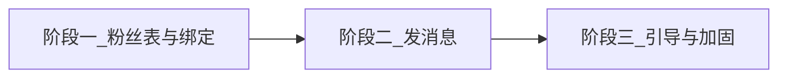

# 微信通知计划

> 存放位置：仓库根目录 [`plan/`](./)（勿放入 `~/.cursor/plans`，便于后续查找）  
> 日期：2026-08-27  
> 范围：仅订单通知（运营服务号、员工服务号、居民小程序订阅）。不含居民登录弹窗、Token 时效与三端刷新。

---

## 目标总览

1. **打基础**：记录服务号粉丝，并把运营 `Admin`、员工 `Worker` 绑到粉丝表。  
2. **发消息**：居民下单 → 通知有权限的运营；运营派单 → 通知对应员工；员工完成服务 → 通知居民。  
3. **点得开**：运营从服务号消息进入管理端 H5 订单详情（含未登录先登录再回跳）。

---

## 通知口径（已拍板）

内部人（运营、员工）**强制关注服务号**后收模板消息；居民**不强制关注服务号**，只在小程序里引导订阅「服务完成」通知。

| 端 | 通道 | 用户在微信里看到哪 | 点进去 |
|---|---|---|---|
| 运营（管理端 H5） | **服务号模板消息** | 服务号会话 | H5 订单详情 |
| 员工（员工端小程序） | **服务号模板消息**（同一服务号） | 同一服务号会话 | 员工端任务详情 |
| 居民（居民端小程序） | **小程序订阅消息** | 「服务通知」 | 居民端订单详情 / 评价页 |

管理端 H5 **没有 AppID**，不能绑进开放平台当第三个小程序，也不能用小程序订阅消息跳进 H5。H5 只作为服务号模板里的 `url`。

```text
居民小程序下单成功
  → 服务号模板消息 → 所有符合条件的运营 Admin
  → 点击 url 打开管理端 H5 订单详情 → 分配 / 改派

运营分配 / 改派成功
  → 服务号模板消息 → 被派的那一个员工
  → 点击 miniprogram 打开员工端任务详情

员工完成服务
  → 小程序订阅消息 → 下单居民
  → 点击打开居民端订单详情（或评价页）
```

**发给哪些运营：** 同一批 `Admin` 账号（PC「用户管理」创建，PC / H5 共用邮箱密码），不是「运营人员配置」里的客服 `Operator`。

| 条件 | 含义 |
|---|---|
| `Admin.status = ENABLED` | 账号未停用 |
| 有 `orders.cleaning` | 保洁新单才发给他（PC 功能授权 / H5 保洁 Tab 同一 key） |
| 有 `orders.recycling` | 废品新单才发给他 |
| `isSuperAdmin = true` | 保洁、废品都发 |
| 已关注服务号且 `subscribed=true` 并已绑定 `adminId` | 否则微信发不出去 |

没有对应订单菜单的管理员（只做员工管理、轮播图等）不发。未绑定微信的 Admin 跳过并打日志，**不阻断下单**。

**不要混用：**

- 运营 / 员工不要用小程序订阅当主通道（运营跳不了 H5；员工会被一次性授权拖死）。  
- 居民不要用服务号当主通道（会变成变相强制关注）。  
- 三套模板 ID 不能混：服务号模板 ≠ 小程序订阅模板；运营跳 H5、员工跳员工小程序、居民跳居民小程序。

若服务号后台申请不到旧版「模板消息」，运营 / 员工再降级为服务号「订阅通知」（需在内部页再订一次）；居民通道不用改。

---

## 前置条件（开工前必须具备）

下列由运营 / 主体管理员在微信后台完成，开发无法代替。缺任一项，对应通道只能 mock 或跳过发送。

### A. 账号与主体

| # | 条件 | 说明 |
|---|---|---|
| A1 | 企业主体已认证 | 与小程序同一主体（「大洋云洁生态」营业执照） |
| A2 | **已认证服务号** | 订阅号不能作本业务通知通道 |
| A3 | 居民端、员工端小程序均已创建 | 各有 AppID / AppSecret |
| A4 | 微信开放平台账号 | 把 **居民小程序 + 员工小程序 + 服务号** 绑到 **同一开放平台**，否则可能没有 `unionid` |
| A5 | 管理端 H5 **不**申请小程序 | 无需也不应把 H5 绑进开放平台 |

### B. 域名与服务号后台

| # | 条件 | 说明 |
|---|---|---|
| B1 | H5 使用 **已备案 HTTPS 域名** | 模板消息 `url` 不支持纯 IP（测试机 `118.195.149.50` 不能作为跳转目标） |
| B2 | H5 按现网托管在 `/admin/` | 生产 `base` 见 `apps/miniapp-admin`；hash 路由 |
| B3 | 服务号 **服务器配置** | 公网 HTTPS 回调，例如 `https://域名/api/v1/wechat/oa/callback`；Token / EncodingAESKey 与 `.env` 一致 |
| B4 | 服务号 **网页授权回调域名** | 填 H5 所在根域名（不含 `https://` 与路径），便于以后网页授权补绑 |
| B5 | JS 接口安全域名（可选） | 仅当改用服务号「订阅通知」网页组件时才必须 |

### C. 类目与模板（见下一节申请步骤）

| # | 条件 | 说明 |
|---|---|---|
| C1 | 服务号已选服务类目 | 与营业执照匹配，例如生活服务 / 家政 / 清洁清洗；最多 5 个类目，每月可改 5 次，**改类目会删掉该类目下已选模板** |
| C2 | 居民端小程序已选类目 | 订阅消息模板库按小程序类目开放 |
| C3 | 已选用本期 3 类模板并拿到 ID | 运营待派单、员工新任务（改派可复用或另选）、居民服务完成 |
| C4 | 禁止营销文案 | 只能发服务进度类通知，否则会被拦截 |

### D. 系统配置

环境变量（写入 `.env.example` 与部署文档，**勿提交真实密钥**）：

```text
# 居民端小程序（已有；发订阅消息用）
WECHAT_CUSTOMER_APPID=
WECHAT_CUSTOMER_SECRET=

# 员工端小程序（模板消息跳转任务详情用 AppID）
WECHAT_WORKER_APPID=
WECHAT_WORKER_SECRET=

# 服务号
WECHAT_OA_APPID=
WECHAT_OA_SECRET=
WECHAT_OA_TOKEN=
WECHAT_OA_AES_KEY=
WECHAT_OA_ENCODING_MODE=plain

# 服务号模板 ID（公众平台选用后粘贴）
WECHAT_OA_TMPL_NEW_ORDER=
WECHAT_OA_TMPL_WORKER_ASSIGNED=
# 可选：改派给原员工「任务已改派」；不配则改派只通知新员工
WECHAT_OA_TMPL_WORKER_REASSIGNED=

# 居民端小程序订阅消息模板 ID
WECHAT_MP_TMPL_SERVICE_DONE=

# 运营点击消息落地（须备案 HTTPS，末尾保留 /admin/）
WECHAT_ADMIN_H5_BASE_URL=https://example.com/admin/
```

未配置凭证时：回调验签失败返回明确错误；发送逻辑 **安全跳过** 并打日志，不阻断下单 / 派单 / 完成。

---

## 去哪申请消息模板

两套后台、两套模板，不要进错账号。

### 1. 服务号模板消息（运营 + 员工）

入口：[微信公众平台](https://mp.weixin.qq.com) → 登录 **服务号**（不是小程序、不是订阅号）。

1. 左侧找 **功能** → **添加功能插件** → 开通 **模板消息**。  
   部分账号入口在 **广告与服务** / **模板消息**。若只有「订阅通知」没有「模板消息」，见文末降级说明。  
2. **设置行业 / 服务类目**（须先完成微信认证）。按家政保洁、废品回收实际经营范围勾选；类目审核通过后，公共模板库才会出现对应标题。  
3. 进入模板库 → **选用** 到私有模板库 → 复制 **模板 ID**（`template_id`）。  
4. 打开选用后的模板，记下每个关键词的字段名与类型（如 `character_string01`、`thing02`、`time03`），开发发信时 `data` 必须一致，超长会被拒。  
5. 每个服务号同时最多约 **25** 个私有模板；日调用有上限（后台开发者中心可查）。

**本期建议选用的标题方向**（以类目库实际标题为准，不要自定义营销标题）：

| 用途 | 发给谁 | 建议字段 | 点击跳转 |
|---|---|---|---|
| 新订单待派单 | 运营 Admin | 订单号、服务类型、预约时间、地址摘要 | `url` → `{WECHAT_ADMIN_H5_BASE_URL}#/pages/order-detail/index?id={id}&type=cleaning\|recycling` |
| 新任务待接单 | 被派员工 | 订单号、预约时间、服务地址 | `miniprogram.appid` = 员工端 AppID；`pagepath` = `pages/task-detail/index?id={id}&type=cleaning\|recycling` |
| 任务已改派（可选） | 被换下的员工 | 订单号、说明 | 同上，或只打开任务列表 `pages/tasks/index` |

官方发送接口：`POST https://api.weixin.qq.com/cgi-bin/message/template/send?access_token=...`  
说明文档：[模板消息](https://developers.weixin.qq.com/doc/service/guide/product/template_message/Template_Message_Interface.html)。

关注即可反复发送，**不需要**运营 / 员工每次在小程序里点「同意接收」。

### 2. 小程序订阅消息（仅居民）

入口：[微信公众平台](https://mp.weixin.qq.com) → 登录 **居民端小程序** → **功能** → **订阅消息**。

1. 确认小程序类目已审过（与服务号类目分开配置）。  
2. 公共模板库选用「服务完成 / 订单完成 / 待评价」类一次性订阅模板。  
3. 复制模板 ID 到 `WECHAT_MP_TMPL_SERVICE_DONE`。  
4. 记下关键词类型与字数限制，与后端 `data` 对齐。

居民端在 **预约成功页**（或订单详情）调用 `wx.requestSubscribeMessage`，用户同意一次，才能在「完成服务」时发一条。拒绝不挡下单。

长期订阅仅对政务民生、医疗等开放，家政保洁按 **一次性** 做。

官方：前端 [wx.requestSubscribeMessage](https://developers.weixin.qq.com/miniprogram/dev/api/open-api/subscribe-message/wx.requestSubscribeMessage.html)；后端 `POST https://api.weixin.qq.com/cgi-bin/message/subscribe/send?access_token=...`（用 **居民小程序** 的 access_token，不是服务号的）。

### 3. 降级：只有订阅通知、没有模板消息

服务号后台若已引导至「订阅通知」：

- 入口仍在公众平台该服务号 → **订阅通知** → 选用模板 → 接口 `cgi-bin/message/subscribe/bizsend`。  
- 已关注用户消息进服务号会话，未关注进「服务通知」。  
- 一次性订阅：订一次发一条，不适合「每有新单就通知所有运营」。内部人可在 H5 / 员工端登录后用网页组件补订，或走制度要求关注后看能否开通长期订阅（家政类目通常没有）。  
- **先按模板消息设计代码**（关注即可发）；若上线前确认没有模板消息权限，再改发送接口与运营补订流程。

---

## 运营流程

### 入职：运营管理员

1. 超管在 **PC 后台 → 用户管理** 创建 Admin（邮箱 + 密码），状态启用。  
2. **功能授权** 勾选 `orders.cleaning` 和 / 或 `orders.recycling`（只做投诉、配置的人不要勾，避免被新单刷屏）。超管不必勾，系统视为两边都有。  
3. 该员工用微信 **扫描服务号带参二维码**（scene 含 `admin_{id}`）关注；关注后粉丝表写入 `adminId`。  
4. 告知：派单在微信点开消息进入 **管理端 H5**，不是 PC。PC 仍可派单，但不走这条推送点击路径。  
5. 未关注 / 未绑定：下单成功照常，只是收不到微信；H5 / PC 登录后可展示绑定入口。

### 入职：服务人员

1. PC **员工管理** 建档（手机号 + 密码），在职。  
2. 入职要求关注同一服务号，扫带参码 `worker_{id}`（或先登录员工端再出示绑定码）。  
3. 粉丝表写入 `workerId`。之后派单通知走服务号 openid，**不依赖**员工小程序 `wx.login`。  
4. 员工点消息进入 **员工端小程序** 任务详情，仍用手机号登录。

### 日常履约

```text
居民在居民端下单（不强制关注服务号）
  → 预约成功页引导订阅「服务完成」通知（可拒绝）

系统：给所有 ENABLED + 对应订单权限 + 已绑定服务号的 Admin 发「待派单」

运营在微信服务号会话点开
  → 打开 H5 详情（未登录则先登录，再回到该详情）
  → 分配 / 改派

系统：给被派员工发「新任务」
      改派时给新员工发「新任务」；若配置了改派模板，再给原员工发「已改派」

员工上门完成（现有 /complete）
  → 若居民曾同意订阅，发小程序「服务完成」到「服务通知」
```

### 离职 / 停用 / 取关

| 事件 | 系统行为 |
|---|---|
| Admin 停用 | 发送前过滤 `ENABLED`，不再发 |
| 撤销保洁/废品菜单 | 不再发对应品类新单 |
| 员工离职 `RESIGNED` | 不可被派单，自然无新的员工通知 |
| 微信取关服务号 | 回调把 `subscribed=false`，发送前再查，停发 |
| 居民拒绝订阅或从未点同意 | 完成服务时跳过居民通知，订单仍完成 |

### 排障（运营可配合）

- 运营没收到：查是否启用、是否有对应菜单、是否仍关注、粉丝表是否有 `adminId`。  
- 点开不是详情：查 `WECHAT_ADMIN_H5_BASE_URL` 是否备案域名、hash 深链是否被登录页丢掉。  
- 员工没收到：查是否关注绑定、是否派到该 `workerId`。  
- 居民没收到：查预约成功时是否点过允许、模板 ID 是否居民端小程序的。

---

## 现状摘要（问题基线）

| 项 | 现状 |
|---|---|
| 居民身份 | `Resident.openid`（小程序），足够发订阅消息 |
| 员工身份 | 手机号 + 密码；**无** 服务号绑定 |
| 运营身份 | `Admin` 邮箱 + 密码；PC 与 H5 共用；**无** 微信 / 服务号绑定 |
| 服务号 | **无** 回调、无粉丝表、无模板发送 |
| 管理端 H5 | 已能登录、看保洁/废品订单、分配/改派；登录成功一律进列表，**无消息深链接力** |

居民 / 员工 / 管理员是三张表。同一微信用户可能既是运营又是员工，服务号粉丝表用 `adminId` / `workerId` / `residentId` 可空外键关联，**不要**只把 openid 塞进其中一张业务表。

本期发信主路径：

- 运营 / 员工：粉丝表 `oaOpenid`（须 `subscribed=true` 且已绑 `adminId` 或 `workerId`）。  
- 居民：`Resident.openid`（小程序）。  
- `unionid`、员工小程序 `mpOpenid` 本期发信非必须。

---

## 开发流程

实施时一次只推进一个阶段；阶段一、二依赖前置条件 A–C。



### 阶段一：服务号粉丝 + 账号绑定

**1.1 数据模型**

新增长期粉丝表（推荐名：`wechat_oa_followers`）：

| 字段 | 说明 |
|---|---|
| `id` | 主键 |
| `oaOpenid` | 服务号 openid（发模板消息用），唯一 |
| `unionid` | 开放平台 UnionID，可空 + 索引 |
| `subscribed` | 是否仍关注 |
| `subscribedAt` / `unsubscribedAt` | 关注 / 取关时间 |
| `adminId` | 可空，对上运营 Admin |
| `workerId` | 可空，对上员工 |
| `residentId` | 可空，对上居民（本期发信不用，便于以后扩展） |
| `createdAt` / `updatedAt` | 审计 |

同一粉丝可同时填 `adminId` 与 `workerId`（内部人兼职）。

**1.2 服务号关注回调**

- `GET/POST /api/v1/wechat/oa/callback`：GET 验签回 `echostr`；POST 处理 `subscribe` / `unsubscribe` / 扫码带参。  
- `subscribe`：`FromUserName` → `oaOpenid` → `user/info` 取 `unionid` → upsert 粉丝表。scene 为 `admin_{id}` / `worker_{id}` 时直接写外键。  
- `unsubscribe`：`subscribed=false`，之后不发。

**1.3 带参二维码**

- 后端用服务号接口生成永久或临时带参码。  
- 管理端：PC 用户管理 / H5 登录后展示「关注服务号接收派单通知」。  
- 员工端：「我的」展示绑定码。  
- 未绑定不挡登录。

**阶段一交付：** 表结构 + 回调 + 运营/员工扫码绑定可验收；尚不发送真实模板也可。

### 阶段二：按节点发消息

发送失败只打日志（建议以后加发送记录表），**不阻断**下单、派单、完成。

**2.1 居民下单成功 → 运营**

触发：保洁 / 废品创建订单成功（状态 `PENDING_ASSIGN`）。

```text
按订单类型取 menuKey（cleaning → orders.cleaning，recycling → orders.recycling）
  → 查 ENABLED Admin：超管 或 权限表含该 menuKey
  → 粉丝表 subscribed=true 且 adminId 命中
  → 服务号 template/send
       touser = oaOpenid
       template_id = WECHAT_OA_TMPL_NEW_ORDER
       url = {H5基址}#/pages/order-detail/index?id={id}&type={cleaning|recycling}
```

家政咨询单本期 **不发**（H5 无家政 Tab）。

**2.2 分配 / 改派成功 → 员工**

触发：现有 `POST .../assign`、`.../reassign` 成功之后。

```text
查被派 workerId → 粉丝表 subscribed=true AND workerId=?
  → template/send
       miniprogram.appid = WECHAT_WORKER_APPID
       miniprogram.pagepath = pages/task-detail/index?id={id}&type=...
改派：新员工发新任务；若配置了 REASSIGNED 模板，再通知原员工
```

**2.3 完成服务 → 居民**

触发：现有 `POST .../complete` 成功之后。

```text
读 Resident.openid（无则跳过）
  → 居民小程序 subscribe/send
       template_id = WECHAT_MP_TMPL_SERVICE_DONE
       page = pages/order-detail/index?id={id}
         或 pages/review/index?id={id}
```

居民未授权时微信返回错误，记日志即可。

**2.4 管理端 H5 深链（点开消息要用）**

- 未登录打开详情：先记下目标 url，`reLaunch` 登录页。  
- 登录成功：回到该详情，不要一律 `/pages/orders/index`。  
- 401 清登录时尽量保留深链。  
- 路由守卫（`useRouteGuard.ts`）不得把带 query 的详情重定向丢参。

**2.5 居民端订阅引导**

- 预约成功页（保洁 / 废品）在用户点击行为里调 `wx.requestSubscribeMessage({ tmplIds: [服务完成模板] })`。  
- 不可在 `onLoad` 里偷偷弹。  
- 详情页可再给一次「开启完成通知」。

**2.6 代码模块建议**

- `WechatOaService`：服务号 token 缓存、user/info、带参码、template send  
- `WechatOaController`：回调  
- `WechatCustomerService`（已有）：扩展订阅消息 send  
- `NotifyService`：解析收件人、组装 data、异步发送  
- 注入点：创建订单、`assignOrder` / `reassignOrder`、`completeOrder`（保洁 + 废品）

### 阶段三：引导与加固

| # | 项 | 说明 |
|---|---|---|
| 3.1 | 员工 / 运营绑定入口 | 未绑定常驻提示 + 带参码；不挡登录 |
| 3.2 | 居民订阅引导 | 预约成功必弹一次；详情可补；**不**引导关注服务号作为下单条件 |
| 3.3 | 取关后停发 | 回调更新 `subscribed`；发送前再检查 |
| 3.4 | 发送失败可观测 | 日志；可选通知发送记录表（openid、模板、errcode、msgid） |
| 3.5 | Mock | 未配服务号 / 小程序凭证时发送跳过；开发可用固定 openid 测组装逻辑 |
| 3.6 | 代下单双接收人、派单中途通知居民 | **不在本期主路径**；以后加居民订阅次数再扩展 |

---

## 验收标准

1. 运营 / 员工扫码关注后，粉丝表 `adminId` / `workerId` 正确；取关后 `subscribed=false` 且不再发。  
2. 居民下保洁单：仅有保洁权限（及超管）且已绑定的 Admin 收到服务号消息；点开进入 H5 对应详情（含先登录再回跳）。无权限或未绑定的人无消息，下单成功。  
3. 运营分配后，仅被派员工收到服务号消息，点开进入员工端该任务。改派行为符合 2.2。  
4. 员工完成后：曾在预约成功页同意订阅的居民，在「服务通知」收到完成提醒；未同意则无消息，订单仍完成。

---

## 相关代码索引

- 居民预约成功 / 详情（订阅弹窗将加在这些页）：`apps/miniapp-customer/src/pages/booking-cleaning`、`booking-recycling`、`order-detail`、`review`  
- 员工任务详情：`apps/miniapp-worker/src/pages/task-detail`  
- 管理端 H5 深链：`apps/miniapp-admin/src/pages/login`、`pages/order-detail`、`composables/useRouteGuard.ts`  
- 派单 / 完成：`apps/server/src/modules/cleaning-order/*`、`recycling-order/*`  
- 权限 key：`apps/server/src/modules/admin-permission/constants/menu-keys.constant.ts`  
- Schema：`apps/server/prisma/schema.prisma`（`Resident` / `Worker` / `Admin`）  
- Env 示例：`.env.example`

---

## 文档维护

- 本文件路径：[`plan/wechat-notify-auth-roadmap.md`](./wechat-notify-auth-roadmap.md)（文件名沿用旧称，内容仅通知）  
- 后续细分任务可在同目录追加，例如 `plan/phase-1-oa-followers.md`、`plan/phase-2-notify-send.md`。  
- 与 [`docs/CodingPlan.md`](../docs/CodingPlan.md) P6.2（历史「多节点居民订阅」）不一致时，**以本文本期主路径为准**；P6.2 其余节点作为后续增强。
