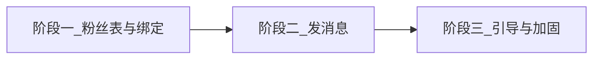

# 微信通知计划

> 存放位置：仓库根目录 [`plan/`](./)（勿放入 `~/.cursor/plans`，便于后续查找）  
> 日期：2026-08-27  
> 修订：2026-08-31 补关注入口、OAuth 与 hash 路由分流、员工 `WechatWorkerService`；运营绑定「推荐先关注，允许先授权后关注」。同日更早：运营改为微信内 H5 网页授权、员工改为 unionid 配对；**不做**入职带参码绑定。2026-08-28 取消居民端小程序订阅消息。  
> 范围：仅订单通知（运营服务号、员工服务号）。**不做**居民小程序订阅消息、**不**在完成服务时通知居民。不含居民登录弹窗、Token 时效与三端刷新。

---

## 目标总览

1. **打基础**：记录服务号粉丝；运营用微信内 H5 网页授权绑 `Admin`；员工用 `unionid` 把小程序登录与服务号粉丝对上 `Worker`。  
2. **发消息**：居民下单 → 通知有权限的运营；运营派单 → 通知对应员工。  
3. **点得开**：运营从服务号消息进入管理端 H5 订单详情（含未登录先登录再回跳）；员工从服务号消息进入员工端任务详情（含未登录先登录再回跳）。

---

## 通知口径（已拍板）

内部人（运营、员工）**强制关注服务号**后收模板消息。居民**不强制关注服务号**，本期也**不**做小程序订阅消息。

| 端 | 通道 | 用户在微信里看到哪 | 点进去 |
|---|---|---|---|
| 运营（管理端 H5） | **服务号模板消息** | 服务号会话 | H5 订单详情 |
| 员工（员工端小程序） | **服务号模板消息**（同一服务号） | 同一服务号会话 | 员工端任务详情；未登录先登录再回跳 |
| 居民（居民端小程序） | **本期不发** | — | — |

管理端 H5 **没有 AppID**，不能绑进开放平台当第三个小程序，也不能用小程序订阅消息跳进 H5。H5 只作为服务号模板里的 `url`。

```text
居民小程序下单成功
  → 服务号模板消息 → 所有符合条件的运营 Admin
  → 点击 url 打开管理端 H5 订单详情 → 分配 / 改派

运营分配 / 改派成功
  → 服务号模板消息 → 被派的那一个员工
  → 点击 miniprogram 打开员工端任务详情

员工完成服务
  → 本期不通知居民
```

**发给哪些运营：** 同一批 `Admin` 账号（PC「用户管理」创建，PC / H5 共用邮箱密码），不是「运营人员配置」里的客服 `Operator`。

| 条件 | 含义 |
|---|---|
| `Admin.status = ENABLED` | 账号未停用 |
| 有 `orders.cleaning` | 保洁新单才发给他（PC 功能授权 / H5 保洁 Tab 同一 key） |
| 有 `orders.recycling` | 废品新单才发给他 |
| `isSuperAdmin = true` | 保洁、废品都发 |
| 已关注服务号且 `subscribed=true` 并已绑定 `adminId` | 否则微信发不出去 |

没有对应订单菜单的管理员（只做员工管理、轮播图等）不发。未绑定微信的 Admin 跳过并打日志，**不阻断下单**。

**不要混用：**

- 运营 / 员工不要用小程序订阅当主通道（运营跳不了 H5；员工会被一次性授权拖死）。  
- 居民不要用服务号当主通道（会变成变相强制关注）；本期也不做居民订阅。  
- 两套服务号模板 ID 不能混：运营跳 H5、员工跳员工小程序。

若服务号后台申请不到旧版「模板消息」，运营 / 员工再降级为服务号「订阅通知」（需在内部页再订一次）。

---

## 前置条件（开工前必须具备）

下列由主体管理员在微信后台完成，开发无法代替。缺任一项，对应通道只能 mock 或跳过发送。

**本节只有 A / B / T / D。** 人员关注与绑定见后文 **§E**（功能做完后入职做，不是开发开工前置）。口头「做 C4」一律指 [`code-update-steps.md`](./code-update-steps.md) 的绑定步骤，不是下面的模板项。

### A. 账号与主体

| # | 条件 | 说明 |
|---|---|---|
| A1 | 企业主体已认证 | 与小程序同一主体（「大洋云洁生态」营业执照） |
| A2 | **已认证服务号** | 订阅号不能作本业务通知通道 |
| A3 | 员工端小程序已创建 | 有 AppID / AppSecret，供模板消息跳转任务详情；居民端小程序已有（下单用），本期通知不依赖它 |
| A4 | **微信开放平台（员工绑定硬依赖）** | 把 **员工端小程序 + 服务号** 绑到同一开放平台，否则两边没有同一 `unionid`，员工对不上服务号 OpenID。居民端可一并绑定，不影响本期发信。运营绑定走网页授权，**不依赖** unionid |
| A5 | **服务号关联员工端小程序** | 这与开放平台绑定是两件事。服务号后台 → 广告与服务 → 小程序管理 → 添加/关联员工端小程序；员工端小程序后台须允许公众号关联，否则模板消息不能可靠跳入员工端 |
| A6 | 管理端 H5 **不**申请小程序 | 无需也不应把 H5 绑进开放平台 |

### B. 域名与服务号后台

| # | 条件 | 说明 |
|---|---|---|
| B1 | H5 使用 **已备案 HTTPS 域名** | 模板消息 `url` 不支持纯 IP（测试机 `118.195.149.50` 不能作为跳转目标） |
| B2 | H5 按现网托管在 `/admin/` | 生产 `base` 见 `apps/miniapp-admin`；hash 路由 |
| B3 | 服务号 **服务器配置** | 公网 HTTPS **消息回调**（关注/取关 XML），例如 `https://域名/api/v1/wechat/oa/callback`；Token 与 `.env` 一致；本期固定明文模式 `plain`。**不要**把网页授权也接到这个地址 |
| B4 | 服务号 **网页授权回调域名（运营绑定硬依赖）** | 填 H5 所在根域名（不含 `https://` 与路径）。微信后台只填域名。本期 `redirect_uri` 用 **后端** `https://域名/api/v1/wechat/oa/oauth/callback`（**不能带 hash**），换 code 后 302 到 `/admin/oauth-callback` 再进 H5。不要把授权接到 B3 的消息回调地址 |
| B5 | JS 接口安全域名（可选） | 仅当改用服务号「订阅通知」网页组件时才必须 |
| B6 | 服务号菜单或自动回复给出 H5 入口 | 运营须用微信打开管理端；建议菜单「派单后台」指向 `{WECHAT_ADMIN_H5_BASE_URL}`，避免只能靠群里发链接 |

### T. 类目与模板（见下一节申请步骤）

| # | 条件 | 说明 |
|---|---|---|
| T1 | 服务号已选服务类目 | 与营业执照匹配，例如生活服务 / 家政 / 清洁清洗；最多 5 个类目，每月可改 5 次，**改类目会删掉该类目下已选模板** |
| T2 | 已选用本期服务号模板并拿到 ID | 运营待派单、员工新任务（改派可复用或另选）。**不申请**居民端小程序订阅模板 |
| T3 | 禁止营销文案 | 只能发服务进度类通知，否则会被拦截 |
| T4 | 模板字段契约已抄入本文 | 不能只拿模板 ID；须把后台实际关键词名、类型、长度逐项记录到下方“模板字段契约”。步骤手册 **C5/C6** 发信代码不得猜字段名。未填完可做绑定，**不得验收真实发送** |

### D. 系统配置

环境变量（写入 `.env.example` 与部署文档，**勿提交真实密钥**）：

```text
# 员工端小程序（模板消息跳转任务详情用 AppID）
WECHAT_WORKER_APPID=
WECHAT_WORKER_SECRET=

# 服务号
WECHAT_OA_APPID=
WECHAT_OA_SECRET=
WECHAT_OA_TOKEN=
WECHAT_OA_AES_KEY=
WECHAT_OA_ENCODING_MODE=plain  # 本期只实现 plain；安全模式另开任务

# 服务号模板 ID（公众平台选用后粘贴）
WECHAT_OA_TMPL_NEW_ORDER=
WECHAT_OA_TMPL_WORKER_ASSIGNED=
# 可选：改派给原员工「任务已改派」；不配则改派只通知新员工
WECHAT_OA_TMPL_WORKER_REASSIGNED=

# 运营点击消息落地（须备案 HTTPS，末尾保留 /admin/）
WECHAT_ADMIN_H5_BASE_URL=https://example.com/admin/
```

`WECHAT_CUSTOMER_APPID` / `WECHAT_CUSTOMER_SECRET` 已有（居民登录），**本期通知不使用**，不要为此新增 `WECHAT_MP_TMPL_*`。  
员工绑定须另用 `WECHAT_WORKER_APPID` / `WECHAT_WORKER_SECRET` 调员工端 `code2session`（与居民端凭证不可混用）。代码里拆两个开关：`hasWechatOaCredentials`（服务号）、`hasWechatWorkerCredentials`（员工小程序）；只配其一则对应通道跳过。

未配置凭证时：回调验签失败返回明确错误；发送逻辑 **安全跳过** 并打日志，不阻断下单 / 派单 / 完成。

---

## E. 入职绑定（功能上线后，每个人做一次）

**不是**开发开工前置。步骤手册 C4 落地之后，每个要收通知的人做一次。只关注、不完成绑定，系统对不上是哪个 Admin / Worker。

关注用的是**服务号自己的二维码 / 搜服务号**，不是系统生成的绑定码。本期**不做**入职带参码。

#### 运营人员（管理端 H5）

全程在**手机微信**里（不要用 Safari、Chrome、PC 浏览器完成绑定）。

**推荐顺序：** 先关注 → 再授权。先授权、后关注也可以绑上 `adminId`，但关注前收不到模板消息；中间若有新单不会补发。授权和关注必须是**同一个微信号**。

怎么关注：搜服务号名称、扫服务号资料页二维码，或 H5 绑定页展示的服务号二维码（未关注时必须展示，可长按识别）。

1. **关注本业务服务号**（关注事件只写入粉丝 OpenID，此时还没有 `adminId`）。  
2. **用微信打开管理端 H5**。链接：服务号自定义菜单 / 自动回复、或超管发到工作群的 `{WECHAT_ADMIN_H5_BASE_URL}`。  
3. 用 **邮箱 + 密码** 登录（与 PC「用户管理」同一套 Admin）。  
4. 点「绑定微信接收派单通知」，走服务号 **网页授权**（`snsapi_base`）。`redirect_uri` 落到 `/admin/oauth-callback`（无 hash），再跳回 H5。后端用 `code` 换服务号 OpenID，写入粉丝表 `adminId`。  
5. 系统再查是否仍关注：未关注则展示服务号二维码并提示关注；**未关注则模板发不出去**。

PC 后台可以派单，但 **PC 上完不成微信绑定**。不在微信内打开 H5 时，页面须提示「请用微信打开本页」。

#### 服务人员（员工端小程序）

**推荐：** 先关注再 `wx.login`。先登录后关注也可以，后到的一步用同一 `unionid` 补全。

怎么关注：员工端 **「我的」** 展示服务号二维码或「去关注」（保存到相册后微信扫一扫 / 长按识别）。小程序内不能直接调起「关注公众号」组件作为本期硬依赖。

1. **关注同一服务号**（关注后粉丝表有 `oaOpenid`，开放平台就绪时还有 `unionid`）。  
2. 用已录入的 **手机号 + 默认密码** 登录员工端（登录方式不变）。  
3. 在 **「我的」** 点绑定（登录后也可静默尝试一次；入口以「我的」为准）：调用 **`wx.login`**，后端 `WechatWorkerService` 用员工端 `code2session` 记下 `unionid`（及小程序 openid）。  
4. 系统用 `unionid` 把 Worker 和粉丝表对上，写入 `workerId`。微信 **没有**「拿 unionid 去查 OpenID」的接口。  
5. 只 `wx.login`、未关注：没有服务号 OpenID，发不了模板。只关注、开放平台未绑好或拿不到 unionid：对不上，须提示关注 / 检查开放平台。

兼职（既是运营又是员工）须两边各绑一次。

---

## 去哪申请消息模板

只需服务号后台。不要进居民端小程序申请订阅消息。

### 1. 服务号模板消息（运营 + 员工）

入口：[微信公众平台](https://mp.weixin.qq.com) → 登录 **服务号**（不是小程序、不是订阅号）。

1. 左侧找 **功能** → **添加功能插件** → 开通 **模板消息**。  
   部分账号入口在 **广告与服务** / **模板消息**。若只有「订阅通知」没有「模板消息」，见文末降级说明。  
2. **设置行业 / 服务类目**（须先完成微信认证）。按家政保洁、废品回收实际经营范围勾选；类目审核通过后，公共模板库才会出现对应标题。  
3. 进入模板库 → **选用** 到私有模板库 → 复制 **模板 ID**（`template_id`）。  
4. 打开选用后的模板，记下每个关键词的字段名与类型（如 `character_string01`、`thing02`、`time03`），开发发信时 `data` 必须一致，超长会被拒。  
5. 每个服务号同时最多约 **25** 个私有模板；日调用有上限（后台开发者中心可查）。

**本期建议选用的标题方向**（以类目库实际标题为准，不要自定义营销标题）：

| 用途 | 发给谁 | 建议字段 | 点击跳转 |
|---|---|---|---|
| 新订单待派单 | 运营 Admin | 订单号、服务类型、预约时间、地址摘要 | `url` → `{WECHAT_ADMIN_H5_BASE_URL}#/pages/order-detail/index?id={id}&type=cleaning\|recycling` |
| 新任务待接单 | 被派员工 | 订单号、预约时间、服务地址 | `miniprogram.appid` = 员工端 AppID；`pagepath` = `pages/task-detail/index?orderId={id}&orderType=cleaning\|recycling` |
| 任务已改派（可选） | 被换下的员工 | 订单号、说明 | 同上，或只打开任务列表 `pages/tasks/index` |

### 服务号模板字段契约（申请后必须填写）

下面不能凭建议字段开发。申请完成后，由运营把微信后台“模板详情”逐项抄入；没有填完时可开发 token、回调和绑定，但**不得验收真实发送**。

| 环境变量 | 微信后台模板标题 / ID | 关键词名（原样） | 类型与最大长度 | 业务值来源 |
|---|---|---|---|---|
| `WECHAT_OA_TMPL_NEW_ORDER` | 待填写 | 待填写，例如 `character_string1`（仅示意） | 待填写 | 订单号 |
| 同上 | 同上 | 待填写 | 待填写 | 服务类型 |
| 同上 | 同上 | 待填写 | 待填写 | 预约时间 |
| 同上 | 同上 | 待填写 | 待填写 | 地址摘要 |
| `WECHAT_OA_TMPL_WORKER_ASSIGNED` | 待填写 | 待填写 | 待填写 | 订单号 |
| 同上 | 同上 | 待填写 | 待填写 | 预约时间 |
| 同上 | 同上 | 待填写 | 待填写 | 服务地址 |
| `WECHAT_OA_TMPL_WORKER_REASSIGNED`（可选） | 待填写 | 待填写 | 待填写 | 订单号 / 改派说明 |

组装 `data` 时只使用上表确认后的关键词；地址等超长值须按微信模板上限截断，并在单测覆盖边界。

官方发送接口：`POST https://api.weixin.qq.com/cgi-bin/message/template/send?access_token=...`  
说明文档：[模板消息](https://developers.weixin.qq.com/doc/service/guide/product/template_message/Template_Message_Interface.html)。

关注即可反复发送，**不需要**运营 / 员工每次在小程序里点「同意接收」。

### 2. 降级：只有订阅通知、没有模板消息

服务号后台若已引导至「订阅通知」：

- 入口仍在公众平台该服务号 → **订阅通知** → 选用模板 → 接口 `cgi-bin/message/subscribe/bizsend`。  
- 已关注用户消息进服务号会话，未关注进「服务通知」。  
- 一次性订阅：订一次发一条，不适合「每有新单就通知所有运营」。内部人可在 H5 / 员工端登录后用网页组件补订，或走制度要求关注后看能否开通长期订阅（家政类目通常没有）。  
- **先按模板消息设计代码**（关注即可发）；若上线前确认没有模板消息权限，再改发送接口与运营补订流程。

---

## 运营流程

### 入职：运营管理员

1. 超管在 **PC 后台 → 用户管理** 创建 Admin（邮箱 + 密码），状态启用。  
2. **功能授权** 勾选 `orders.cleaning` 和 / 或 `orders.recycling`（只做投诉、配置的人不要勾，避免被新单刷屏）。超管不必勾，系统视为两边都有。  
3. 告知该运营按 **§E 运营人员** 完成：推荐先关注 → 微信内打开 H5 → 登录 → 点绑定走网页授权（允许先授权后关注，关注前收不到消息）。回调把服务号 OpenID 写入 `adminId`。  
4. 派单在微信点开消息进入 **管理端 H5**，不是 PC。PC 仍可派单，但不走这条推送点击路径。  
5. 未关注 / 未绑定：下单成功照常，只是收不到微信；用微信打开 H5 登录后可展示绑定入口。

### 入职：服务人员

1. PC **员工管理** 建档（手机号 + 密码），在职。  
2. 告知按 **§E 服务人员** 完成：在「我的」扫服务号码关注；手机号登录后点绑定走 `wx.login`，用 `unionid` 对上粉丝表并写入 `workerId`。  
3. 之后派单通知走服务号 `oaOpenid`，**不是**员工小程序 openid。手机号登录保留；`wx.login` 只用于绑微信。  
4. 员工点消息进入 **员工端小程序** 任务详情；若会话过期，先登录，再自动回到原 `orderId/orderType` 任务详情。

### 日常履约

```text
居民在居民端下单（不强制关注服务号；不引导订阅消息）

系统：给所有 ENABLED + 对应订单权限 + 已绑定服务号的 Admin 发「待派单」

运营在微信服务号会话点开
  → 打开 H5 详情（未登录则先登录，再回到该详情）
  → 分配 / 改派

系统：给被派员工发「新任务」
      改派时给新员工发「新任务」；若配置了改派模板，再给原员工发「已改派」

员工上门完成（现有 /complete）
  → 订单照常完成；本期不向居民发微信
```

### 离职 / 停用 / 取关

| 事件 | 系统行为 |
|---|---|
| Admin 停用 | 发送前过滤 `ENABLED`，不再发 |
| 撤销保洁/废品菜单 | 不再发对应品类新单 |
| 员工离职 `RESIGNED` | 不可被派单，自然无新的员工通知 |
| 微信取关服务号 | 回调把 `subscribed=false`，发送前再查，停发 |

### 排障（运营可配合）

- 运营没收到：查是否启用、是否有对应菜单、是否仍关注、是否用微信打开 H5 完成网页授权、粉丝表是否有 `adminId`。  
- 点开不是详情：查 `WECHAT_ADMIN_H5_BASE_URL` 是否备案域名、hash 深链是否被登录页丢掉。  
- 员工没收到：查是否关注、是否 `wx.login` 已写入 unionid、开放平台是否绑定、粉丝表是否有 `workerId`、是否派到该员工。

---

## 现状摘要（问题基线）

| 项 | 现状 |
|---|---|
| 居民身份 | `Resident.openid`（小程序登录用）；本期通知不使用 |
| 员工身份 | 手机号 + 密码；**无** 服务号绑定、**无** `wx.login` / unionid |
| 运营身份 | `Admin` 邮箱 + 密码；PC 与 H5 共用；**无** 微信 / 服务号绑定 |
| 服务号 | **无** 回调、无粉丝表、无模板发送、无网页授权绑定 |
| 管理端 H5 | 已能登录、看保洁/废品订单、分配/改派；登录成功一律进列表，**无消息深链接力**；**无**微信内绑定入口 |

居民 / 员工 / 管理员是三张表。同一微信用户可能既是运营又是员工，服务号粉丝表用 `adminId` / `workerId` / `residentId` 可空外键关联，**不要**只把 openid 塞进其中一张业务表。`residentId` 本期不绑定、不发信。

本期发信主路径：

- 运营：微信内 H5 网页授权得到粉丝表 `oaOpenid`，须 `subscribed=true` 且已绑 `adminId`。  
- 员工：关注回调的 `oaOpenid` + `unionid` 与员工端 `wx.login` 的 `unionid` 对上后绑 `workerId`；发信仍用 `oaOpenid`。  
- 居民：不发。

---

## 开发流程

实施时一次只推进一个阶段；阶段一、二依赖微信后台前置 **A / B / T / D**。人员按 §E 绑定发生在步骤手册 **C4** 之后，不是写代码的前置。



### 阶段一：服务号粉丝 + 账号绑定

**1.1 数据模型**

新增长期粉丝表（推荐名：`wechat_oa_followers`）：

| 字段 | 说明 |
|---|---|
| `id` | 主键 |
| `oaOpenid` | 服务号 openid（发模板消息用），唯一 |
| `unionid` | 开放平台 UnionID，可空 + 索引（员工绑定用来对上 Worker） |
| `subscribed` | 是否仍关注 |
| `subscribedAt` / `unsubscribedAt` | 关注 / 取关时间 |
| `adminId` | 可空，对上运营 Admin（网页授权写入） |
| `workerId` | 可空，对上员工（unionid 配对写入） |
| `residentId` | 可空，对上居民（本期不绑定、不发信，便于以后扩展） |
| `createdAt` / `updatedAt` | 审计 |

`Worker` 表增加可空 `unionid`（唯一索引）与可选 `mpOpenid`（员工小程序 openid，发信不用）。

关系约束：

- `oaOpenid` 唯一；`adminId`、`workerId` 分别可空唯一（本期一个业务账号只绑定一个微信）。
- Admin / Worker / Resident 删除时对应外键 `onDelete: SetNull`，不因历史粉丝记录阻塞删除。
- 同一粉丝可同时填 `adminId` 与 `workerId`（内部人兼职）。
- 重新绑定时必须显式解绑旧微信；禁止静默覆盖，避免消息发给离职人员。

另建一次性 **OAuth state** 表（表名可用 `wechat_oa_oauth_states`；若沿用 `wechat_oa_bind_tickets` 仅存授权 state，**不是**扫码票据）：

| 字段 | 说明 |
|---|---|
| `id` | 主键 |
| `tokenHash` | 高强度随机 state 的哈希，唯一；数据库不存明文 |
| `targetType` | 本期仅 `ADMIN` |
| `targetId` | 已登录运营的 Admin ID |
| `expiresAt` | 过期时间（建议 10 分钟） |
| `usedAt` | 可空；授权回调成功后一次性消费 |
| `createdByAdminId` / `createdAt` | 审计 |

**1.2 服务号关注回调**

- `GET/POST /api/v1/wechat/oa/callback`：仅处理微信服务器 **消息推送**（GET 验签回 `echostr`；POST 处理 `subscribe` / `unsubscribe`）。本期只支持明文模式；必须校验签名、时间戳新鲜度和 nonce。  
- **关注本身不写入 `adminId`。** `subscribe`：`FromUserName` → `oaOpenid` → `user/info` 取 `unionid` → upsert 粉丝表 `subscribed=true`（已有 `adminId` 必须保留）。若 `unionid` 已出现在某个 `Worker.unionid` 上，则补写 `workerId`。  
- `unsubscribe`：`subscribed=false`，之后不发。  
- **本期不做**带参码绑定，忽略 `SCAN` / `qrscene_*`（不要据此写业务账号）。

**1.3 运营：微信内 H5 网页授权**

两条 URL 不要混：

| 用途 | 地址 | 谁调用 |
|---|---|---|
| 关注/取关 XML | `GET/POST /api/v1/wechat/oa/callback` | 微信服务器（B3） |
| 网页授权 | `GET /api/v1/wechat/oa/oauth/callback` → 302 到 `/admin/oauth-callback?ok=1`（或失败 query） | 用户微信浏览器；`redirect_uri` 须落在 B4 域名且 **无 hash** |

H5 业务页仍是 hash：`{WECHAT_ADMIN_H5_BASE_URL}#/pages/...`。OAuth **不能**把 `redirect_uri` 设成带 `#` 的详情页。落地页 `/admin/oauth-callback` 为无 hash 静态/前端页：读 query 后 `reLaunch` 回 H5 绑定结果或原深链。

- 仅已登录 Admin 可为自己发起绑定（超管可为指定 Admin 发起时仍须该人在微信内完成授权）。生成一次性 state 后跳转 `snsapi_base`。  
- 授权回调用 `code` 换服务号 OpenID（及可选 unionid），校验 state 后 upsert 粉丝表并写入 `adminId`；再 `user/info` 看是否关注。未关注：**保留 `adminId`**，页面展示服务号二维码；发送前仍要求 `subscribed=true`。  
- 禁止客户端提交裸 `adminId`；必须绑定到 state 里的目标账号。  
- 非微信 UA 不跳转授权。未绑定不挡登录。

**1.4 员工：wx.login + unionid 配对**

- 手机号 + 密码登录不变。绑定入口以 **「我的」** 为准（可在登录成功后尝试一次，失败不挡进首页）。前端 `wx.login`，后端 **`WechatWorkerService`**（对标居民 `WechatCustomerService`）用 `WECHAT_WORKER_*` 调 `code2session`，写入 `Worker.unionid`（无则明确失败并提示检查开放平台）。  
- 若粉丝表已有相同 `unionid` 且 `subscribed=true`，写入 `workerId`；若尚未关注，「我的」展示服务号二维码，关注回调再按 1.2 补绑。  
- 不得用 `WECHAT_CUSTOMER_*`。小程序 openid 可存档，**发模板必须用服务号 `oaOpenid`**。  
- 未绑定不挡登录与接单。缺 `WECHAT_WORKER_*` 时绑定接口明确失败，不得 silently 走居民凭证。

**阶段一交付：** 表结构 + 关注/取关回调 + 运营 `/admin/oauth-callback` 授权绑定 + 员工「我的」unionid 绑定可验收；尚不发送真实模板也可。**本期不实现**入职带参码。

### 阶段二：按节点发消息

业务事务成功提交后再安排发送；发送失败只记日志，**不阻断**下单、派单、完成。

本期最低可靠性要求：

- 服务号模板消息传 `client_msg_id`，建议由 `事件类型 + 订单类型 + 订单ID + 收件人openid` 生成，防止短时间重复发送。
- 批量通知运营使用 `Promise.allSettled`（或等价后台任务），单个运营失败不影响其他人。
- 记录事件、订单、脱敏收件人、模板 ID、微信 `msgid/errcode/errmsg`；不得把 access_token / Secret 写入日志。
- 只允许在数据库事务**提交后**触发。若上线要求“进程重启也不丢消息”，须增加 outbox/队列；本期不做队列时要明确接受极端情况下可能丢通知。

**2.1 居民下单成功 → 运营**

触发：保洁 / 废品创建订单成功（状态 `PENDING_ASSIGN`）。

```text
按订单类型取 menuKey（cleaning → orders.cleaning，recycling → orders.recycling）
  → 查 ENABLED Admin：超管 或 权限表含该 menuKey
  → 粉丝表 subscribed=true 且 adminId 命中
  → 服务号 template/send
       touser = oaOpenid
       template_id = WECHAT_OA_TMPL_NEW_ORDER
       url = {H5基址}#/pages/order-detail/index?id={id}&type={cleaning|recycling}
```

家政咨询单本期 **不发**（H5 无家政 Tab）。

**2.2 分配 / 改派成功 → 员工**

触发：现有 `POST .../assign`、`.../reassign` 成功之后。

```text
查被派 workerId → 粉丝表 subscribed=true AND workerId=?
  → template/send
       miniprogram.appid = WECHAT_WORKER_APPID
       miniprogram.pagepath = pages/task-detail/index?orderId={id}&orderType=cleaning|recycling
改派：新员工发新任务；若配置了 REASSIGNED 模板，再通知原员工
```

**不做：** `completeOrder` 后向居民发小程序订阅消息；居民端不调用 `wx.requestSubscribeMessage`。

**2.3 管理端 H5 深链（点开消息要用）**

- 未登录打开详情：先记下目标 url，`reLaunch` 登录页。  
- 登录成功：回到该详情，不要一律 `/pages/orders/index`。  
- 401 清登录时尽量保留深链。  
- 路由守卫（`useRouteGuard.ts`）不得把带 query 的详情重定向丢参。  
- **与 OAuth 落地分开：** `/admin/oauth-callback` 无 hash，只处理绑定结果；不要当成订单深链，也不要把 `redirect_uri` 设成 `#/pages/order-detail/...`。

**2.4 员工端深链登录接力**

- 模板 `pagepath` 使用现有页面实际参数：`orderId` / `orderType`，不能写 `id` / `type`。
- 未登录或 refresh 失效时，员工端先保存目标 `pages/task-detail/index?orderId=...&orderType=...`，再去登录。
- 登录成功后优先回到保存的任务详情；没有目标才走现有首页。
- 目标只允许员工端已知的内部页面和合法参数，不能把任意外部 URL 写入 storage。

**2.5 代码模块建议**

- `WechatOaService`：服务号 token 缓存、user/info、网页授权 `code` 换 OpenID、template send  
- `WechatOaController`：`/wechat/oa/callback`（消息）与 `/wechat/oa/oauth/callback`（授权）分开  
- `WechatWorkerService`：员工端 `code2session`（`WECHAT_WORKER_*`）；**不要**改 `WechatCustomerService` 去换员工 session  
- `NotifyService`：解析收件人、组装 data、异步发送  
- 注入点：创建订单、`assignOrder` / `reassignOrder`（保洁 + 废品）。**不**注入 `completeOrder`

### 阶段三：引导与加固

| # | 项 | 说明 |
|---|---|---|
| 3.1 | 员工 / 运营绑定入口 | 未绑定常驻提示；H5 绑定页与员工「我的」均展示**服务号二维码**（关注用，不是绑定码）；运营非微信打开提示用微信；员工绑定按钮触发 `wx.login`；不挡登录 |
| 3.2 | 取关后停发 | 回调更新 `subscribed`；发送前再检查 |
| 3.3 | 发送失败可观测 | 最低要求结构化日志 + `client_msg_id`；可选通知发送记录表 / outbox |
| 3.4 | Mock | 未配服务号凭证时发送跳过；开发可用固定 openid 测组装逻辑 |
| 3.5 | 居民通知、代下单双接收人 | **不在本期** |

---

## 验收标准

1. 运营在微信内 H5 登录并网页授权后，粉丝表 `adminId` 正确；员工关注 + `wx.login` 后 `workerId` 经 unionid 对上。取关后 `subscribed=false` 且不再发。  
2. 居民下保洁单：仅有保洁权限（及超管）且已绑定的 Admin 收到服务号消息；点开进入 H5 对应详情（含先登录再回跳）。无权限或未绑定的人无消息，下单成功。  
3. 运营分配后，仅被派员工收到服务号消息；页面使用 `orderId/orderType`，未登录时登录后仍回到该任务。改派行为符合 2.2。
4. 员工完成服务后订单照常完成；**不**向居民发微信，居民端**无**订阅弹窗 / 订阅引导。
5. 重复触发同一短时发送不会产生重复服务号消息；某个收件人发送失败不影响其他收件人和主业务。
6. 运营 OAuth state 一次性、防伪造、过期不可用；绑定目标必须是已登录账号。员工不得用居民端凭证换 session；无 unionid / 未关注时不能静默当成已绑定。

---

## 相关代码索引

- 员工绑定入口：`apps/miniapp-worker/src/pages/mine`（「我的」关注码 + 绑定）；登录仍是 `pages/login`（手机号密码，不在此页当绑定主入口）  
- 员工任务深链：`apps/miniapp-worker/src/pages/task-detail`  
- 管理端 H5 深链：`apps/miniapp-admin/src/pages/login`、`pages/order-detail`、`composables/useRouteGuard.ts`  
- 管理端 OAuth 落地（无 hash）：`/admin/oauth-callback`（新建；不要做成 `#/pages/...`）  
- 派单：`apps/server/src/modules/cleaning-order/*`、`recycling-order/*`（注入 create / assign / reassign，**不**注入 complete）  
- 权限 key：`apps/server/src/modules/admin-permission/constants/menu-keys.constant.ts`  
- Schema：`apps/server/prisma/schema.prisma`（`Resident` / `Worker` / `Admin`）  
- Env 示例：`.env.example`

---

## 文档维护

- 本文件路径：[`plan/wechat-notify-auth-roadmap.md`](./wechat-notify-auth-roadmap.md)（文件名沿用旧称，内容仅通知）  
- 后续细分任务可在同目录追加，例如 `plan/phase-1-oa-followers.md`、`plan/phase-2-notify-send.md`。  
- 与 [`docs/CodingPlan.md`](../docs/CodingPlan.md) P6.2（历史「多节点居民订阅」）不一致时，**以本文为准：本期不做居民订阅**。
